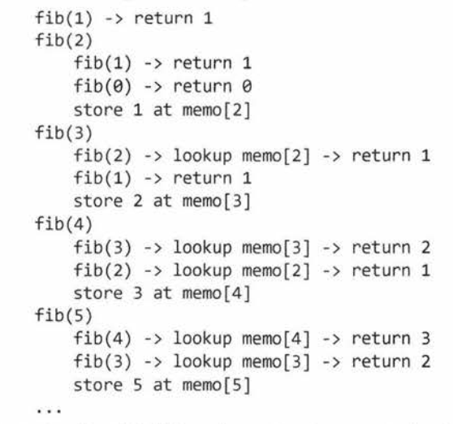

# Chapter VI: Big O

- When you have a recursive function that makes multiple calls, the runtime will often look like O(branches^depth), where branches is the number of times each recursive call branches.

```
int f(int n){
  if (n <= 1){
    return 1;
  }
  return f(n-1) + f(n-1);
}
```

Runtime: O(2^n)

**Note: Fibonacci sequence is also O(2^N)**

---

## Sorting
Suppose we had an algorithm that took in an array of strings, sorted each string and then sorted the full array. What is the runtime?

1. Let `s` be the length of the longest string.
2. Let `a` be the length of the array.
3. Sorting each string is O(s log s)
4. We have to do this for every string (there are `a` strings in 1 array), so that's `O(a * s log s)`
5. Now we have to sort all the strings. **There are `a` strings, so you may be inclined to say `O(a log a)`**. However, we also have to compare the strings.
Each string comparison takes `O(s)` time. There are `O(a log a)` comparisons. So, this takes `O(s*a log a)` time.

In total, you get `O(a*s(log a + log s))`.

---
```
int sum (Node node){
  if (node == null){
    return 0;
  }
  return sum(node.left) + node.value + sum(node.right);
}
```
Runtime?

The most straightforward way is to think about what this means. This code touches each node in the tree once and does a constant amount of work. Therefore, the runtime will be linear in terms of number of nodes. If there are N nodes, then the runtime is O(N).

Another approach...

We are looking at O(2^depth) => O(2^log N).

If we let P = 2 ^ log N, we can rewrite this as log2P = log2N.


---

## Factorial
```
int factorial (int n){
  if (n < 0){
    return -1;
  } else if (n == 0){
    return 1;
  } else {
    return n * factorial(n - 1);
  }
}
```
Runtime?

This is just a straight recursion from n to n-1 to n-2 all the way to 1. **O(n)**

---
## Permutation

```
1   void permutation(String str){
2     permutation(str, "");
3   }
4
5   void permutation(String str, String prefix){
6     if (str.length() == 0){
7       System.out.println(prefix);
8     } else {
9       for (int i = 0; i < str.length(); i++){
10        String rem = str.substring(0, i) + str.substring(i + 1);
11        permutation(rem, prefix + str.charAt(i));
12      }
13    }
14  }
```
*How many times does `permutation` get called in its base case?*

Suppose we have 7 characters in the string. In the first slot, we have 7 choices. Then we will have 6 choices for the next slot, and so on.

Hence, the total number of options is 7!

This tells us that there are n! permutations. Therefore, `permutation` is called n! times in its base case (when `prefix` is the full permutation).

*How many times does permutation get called before its base case?*

We need to consider how many times lines 9 through 12 gets executed. Imagine a large call tree. There are `n!` leaves and each leaf is attached to a path of length `n`. Therefore, there will be no more than `n * n!` nodes (function calls)

Executing line 7 takes O(n) time, since each character needs to be printed.

Line 10 and line 11 will also take O(n) time combined. Observe that the sum of lengths of `rem`, `prefix`, and `str.charAt(i)` will always be `n`.

Each node in our call tree, therefore, corresponds to O(n) work.

*Total Runtime?*
Since we are calling `permutation O(n * n!)` times and each one takes O(n) time, total runtime will not exceed `O(n^2 * n!)`.

---

## Fibonacci with memoization

```
void allFib(int n){
  int[] memo = new int[n+1];
  for (int i = 0; i < n; i++){
    System.out.println(i + ": " + fib(i, memo));
  }
}

int fib(int n, int[] memo){
  if (n <= 0) return 0;
  else if (n == 1) return 1;
  else if (memo[n] > 0) return memo[n];

  memo[n] = fib(n-1, memo) + fib(n-2, memo);
  return memo[n];
}
```
When in doubt, run the algorithm



At each call to fib(i), we have already computed and stored the values for fib(i-1) and fib(i-2). We just look up those values, sum them, store the new result and return. This takes a constant amount of time.

We're doing a constant amount of work N times, so this is O(n).
