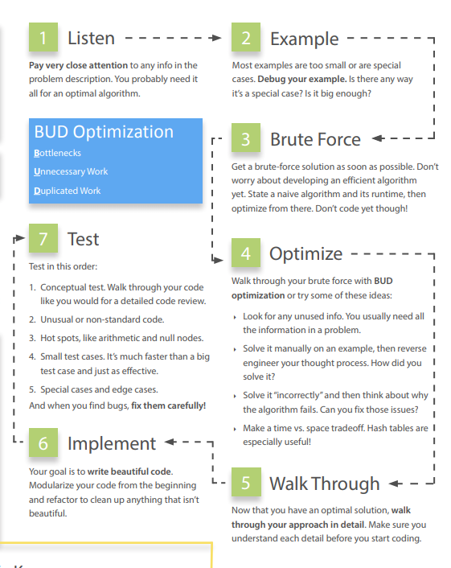

# 7. Technical Questions

## 1. Listen Carefully

You're expected to know:


**In particular, hash tables are an extremely important topic**



Listen carefully to the problem, and be sure that you've mentally recorded any *unique* information in the problem.

For example:
- "Given two arrays that are sorted, find..."  
The optimal algorithm for the sorted situation is probably different than the optimal problem for the unsorted situation.

- "Design an algorithm to be run repeatedly on a server that..."  
This is different from the run-once situation. Perhaps you can cache data? Or perhaps it justifies some reasonable pre-computation on the initial dataset?

It is unlikely that your interviewer would give you this information if it didn't affect the algorithm.
Your first algorithm doesn't need to use the information. But if you find yourself stuck, or you're still working to develop something more optimal, ask yourself if you've used all the information in the problem

## 2. Draw an Example
You want to create an example that is:
1. Specific. It should use real numbers or strings (if applicable to the problem).
2. Sufficiently large. Most examples are too small, by about 50%.
3. Not a special case. Be careful. It's very easy to inadvertently draw a special case. If there's any way your example is a special case (even if you think it probably won't be a big deal), you should fix it.

Try to make the best example you can. If it later turns out your example isn't quite right, you can and should fix it.

## 3. State a brute force
Even if it's obvious for you, it's not necessarily obvious for all candidates. You don't want your interviewer to think that you're struggling to see even the easy solution.

Explain what the space and time complexity is, then dive into improvements.

A brute force algorithm is valuable to discuss. It's a starting point for optimizations and it helps you wrap your head around the problem.

## 4. Optimize
1. Look for any unused information. e.g. was the array sorted?
2. Use a fresh example. Sometimes, seeing a different example will unclog your mind or help you see a pattern in the problem.
3. Solve it "incorrectly". Just like having an inefficient solution can help you find an efficient solution, having an incorrect solution might help you find a correct solution.
4. Make time vs. space trade-off. Sometimes storing extra state about the problem can help you optimize the runtime.
5. Pre-compute information. Is there a way that you can reorganize the data(sorting, etc) or compute some values upfront that will help save time in the long run? (Memoization comes to mind).
6. Use a hash table. **Hash tables are widely used in interview questions** and should be at the top of your mind.
7. Think about best conceivable runtime (discussed later below).

## 5. Walk through your code
After you've nailed down an optimal algorithm, don't just dive into coding. Solidify your understanding of the algorithm.

## 6. Implement
Write beautiful code:
- Modularized code. This shows good coding style.
- Error checks. Some interviewers care a lot about this. A good compromise here is to add a `todo` and then explain what you'd like to test.
- Use other classes/structs where appropriate. You don't necessarily have to fill in the details for the class. Just pretend it exists and deal with the details later if you have the time.
- Good variable names.

If you get confused, go back to your example and walk through it again.

## 7. Test
1. Start with a conceptual test --> Just reading and analysing what each line of code does. Imagine explaining the lines of code for a code reviewer. Does the code do what you think it should do?
2. Weird looking code. Double check that line that says `x = length - 2`. Investigate that for loop that starts at i = 1.
3. Hot spots. Base cases in recursive code. Integer division. Null nodes in binary trees. The start and end of iteration through a linked list. Double check these things.
4. Small test cases. It'll likely discover the same bugs much faster.
5. Special cases. Test your code against null or single element values, the extreme cases, or other special cases.

Carefully analyse why the bug occurred and ensure that your fix is the best solution.

### Optimise & Solve Technique #1: Look for BUD
- Bottlenecks
- Unnecessary work
- Duplicated work

**Bottlenecks**  
A bottleneck is part of your algorithm that slows down the overall runtime. Two common ways:
1. You have one-time work that slows down your algorithm. For example, suppose you have a 2-step algorithm where you first sort the array and then you find elements with a particular property. The first step is `O(N log N)` and the second step is `O(N)`. Until you optimise the first step, your overall algorithm will be `O(N log N)`.
2. You have a chunk of work that is done repeatedly, like searching. Perhaps you can reduce that from `O(N)` to `O(log N)` or `O(1)` even.  

Example:

Given an array of distinct integer values, count the number of pairs of integers that have difference k. For example, array {1, 7, 5, 9, 2, 12, 3} and k = 2, there are four pairs: (1, 3), (3, 5), (5, 7), (7, 9).

**Brute force**:  
Go through the array, starting from the first element, and then search through the remaining elements. For each pair, compute the difference.

The bottleneck here is the repeated search for the "other element" of the pair.

How can we find the right pair quicker? We know that the other side of (x, ?) is either x+k or x-k. If we sorted the array, we could find the other pair for each of the N elements in `O(log N)` time by doing a **binary search**.

We now have a two-step algorithm, where both steps take `O(N log N)` time. Now, sorting is the new bottleneck.

However, we can find things quickly in an unsorted array using a **hash table**.

Throw everything in the array into the hash table. Then to look up if x+k or x-k exist, look it up in the hash table. We can do this in `O(N)` time.
```
The search complexity of a hash table varies from ~O(1) to ~O(N), depending on the number of buckets in the hash table.
Hash tables are O(1) average and amortized case complexity.
```
**Unnecessary Work**  
Example:

Print all positive integer solutions to the equation a^3 + b^3 = c^3 + d^3 where a, b, c, d are integers between 1 and 1000.

**Brute Force**:
Iterate through all possible values of a, b, c, d and check if the equation holds. `O(N^4)`

First, notice that there's only 1 valid d value for each (a, b, c). Since this is the case, we can don't iterate through the d values since we can just use math to calculate the d value. `d = sqrt3(a^3 + b^3 - c^3)`.

We have reduced our runtime to `O(N^3)`.

**Duplicated Work**  
Using the above example, let's look for duplicated work.

The algorithm operates by iterating through all (a, b) pairs and then searching all (c, d) pairs to find if there are any matches to the (a, b) pair.

Instead, we should create a list of (c, d) pairs once. Then, when we have an (a, b) pair, we find the matches within the (c, d) list. We can quickly locate the matches by inserting each (c, d) pair into a **hash table** that maps the sum to the pair.

```
n = 1000
for c from 1 to n
  for d from 1 to n
    result = c^3 + d^3
    append(c, d) to list at value map[result]

for a from 1 to n
  for b from 1 to n
    result = a^3 + b^3
    list = map.get(result)
    for each pair in list:
      print a, b, pair
```
This will take our runtime to `O(N^2)`.

### Optimize & Solve Technique #2: DIY
Example: Given a smaller string s and a bigger string b, design an algorithm to find all permutations of the smaller string within the bigger one. Print the location of each permutation.

Note that permutations are rearrangements of the string, so the characters in s can appear in any order in b. But, they must be contiguous.

Give yourself a big example:
s: abbc
b: cbabadebbabbebabaabcebabc

Almost everyone takes one of two approaches:
1. Walk through b and look at sliding windows of 4 characters (length of s). Check if each window is a permutation of s.
2. Walk through b. Every time you see a character in s, check if the next 3 characters (length of s) are a permutation of s.

If you do a brute force (by creating every single permutation of s and checking against b), you will have a runtime of `O(S! * B)`.
With one of the two approaches, you will get either `O(B*S)`, `O(B * S log S)`, or `O(B * S^2)`, depending on the exact implementation of the "is this a permutation" part. But it's a lot better than what we had before.

Be aware of any optimizations you intuitively make. For example, you might have just skipped right over the sliding window with "d" in it, since "d" isn't in abbc. That's an optimization your brain made, and it's something you should at least be aware of in your algorithm.

### Optimize & Solve Technique #3: Simplify and Generalize
Example: A note can  be formed by cutting words out of a magazine to form a new sentence. How would you figure out if a note (represented as a string) can be formed from a given magazine (string)?

To simplify the problem, we can modify it so that we are cutting characters out of a magazine instead of whole words.

We can solve the simplified ransom note problem with characters by simply creating an array and counting the characters. Each spot in the array corresponds to one letter. First, we count the number of times each character in the ransom note appears, and then we go through the magazine to see if we have all of those characters.

When we generalize the algorithm, we do a very similar thing. This time, rather than creating an array with character counts, we create a hash table that maps from a word to its frequency.

### Optimize & Solve Technique #4: Base Case and Build

We solve the problem first for a base case (e.g. n = 1) and then try to build up from there. When we get to more complex cases, we try to build those using the prior solutions.

Example: Design an algorithm to print all permutations of a string. For simplicity, assume all characters are unique.

Consider a test string abcdefg.

Case "a" --> {"a"}
Case "ab" --> {"ab", "ba"}
Case "abc" --> ?

If we had the answer to P("ab"), how could we generate P("abc")?
We can just stick c in at every possible point. That is:

P("abc") = insert "C" into all locations of all strings in P("ab")
P("abc") = insert "C" into all locations of all strings in {"ab","ba"}
P("abc") = merge( {"cab", "acb", "abc"}, {"cba", "bca", bac"})
P("abc") = {"cab", "aeb", "abc", "eba", "bea", bac"}

Now that we understand the pattern, we can develop a general recursive algorithm. Base Case and Build algorithms often lead to natural recursive algorithms.

### Optimize & Solve Technique #5: Data Structure Brainstorm
Simply run through a list of data structures and try to apply each one.

Example: Numbers are randomly generated and stored into an (expanding) array. How would you keep track of the median?

- Linked list? Probably not. Linked lists tend to not do very well with accessing and sorting numbers.
- Array? Maybe, but you already have an array. Need to keep the elements sorted and it's expensive.
- Binary tree? Possible, since binary trees do fairly well with ordering. If the binary tree is perfectly balanced, the top might be the median. If there's an even number of elements, the median is the average of the middle two elements and we can't have both at the top.
- Heap? Heap is good at maintaining max and mins. If you have two heaps, you could keep track of the bigger half and the smaller half. The bigger half is kept in a min heap and the smaller half kept in a max heap.

### Best Conceivable Runtime (BCR)
Considering the best conceivable runtime can offer a useful hint for some problems.

Example: Compute the number of elements that 2 arrays (of length A and B) have in common. You immediately know that you can't do that better than `O(A + B)` time because you have to touch each element in each array. `O(A + B)` is the BCR.

**Long Example**  
Question: Given two sorted arrays, find the number of elements in common. The arrays are the same length and each has distinct elements.

A: 13 27 35 40 49 55 59  
B: 17 35 39 40 55 58 60

**Brute Force**: `O(N^2)`  
Note that the BCR is `O(N)` because we know we will have to look at each element at least once. So our optimal algorithm is between `O(N^2)` and `O(N)`.

The second `O(N)` comes from searching in the second array.
Since the array is sorted, we can search in a sorted array in `O(log N)` time.
We now have an improved algorithm: `O(N log N)`

Can we do better?

In general, we cannot search an array in better than `O(log N)` time. This is not the general case though. We're doing this search over and over again (more than 1x).

Our focus is still on reducing search from `O(log N)` to `O(1)`. In this case, we can just throw everything in the second array into a **hash table**. This will take `O(N)` time. Then, go through the first array and look up each element in the hash table. This look up is `O(1)`, so our runtime is `O(N)`.

Suppose our interviewer asked us: Can we do better?

No, not in terms of runtime, since we have hit our BCR. We could potentially optimize the space complexity.

Note that we would have achieved the same runtime if the array is not sorted. So why were we given sorted arrays?

So now we're looking for an algorithm that:
- operates in `O(1)` space (probably). Therefore, we need to drop the hash table.
- Operates in `O(N)` time (probably).
- Uses the fact that the arrays are sorted.

Our best algorithm that doesn't use extra space was the binary search one. Let's think about optimizing that.

Try walking through the algorithm:

1. Do a binary search in B for A[0] = 13. Not found.
2. Do a binary search in B for A[1] = 27. Not found.
3. Do a binary search in B for A[2] = 35. Found at B[l] .
4. Do a binary search in B for A[3] = 40. Found at B [5] .
5. Do a binary search in B for A[4] = 49. Not found.
6. ...

Think about **BUD**. The bottleneck is the searching. Is there anything unnecessary or duplicated?

It's unnecessary that A[3] = 40 searched all over B. We know that we just found 35 at B[1], so 40 won't be before 35.

Each binary search should start where the last one left off.

In fact, we can just do a linear search. As long as the linear search in B is picking up where the last one left off, we know that we're going to be operating in linear time.


1. Do a linear search in B for A[0] = 13. Start at B[0] = 17. Stop at B[0] = 17. Not found.
2. Do a linear search in B for A[1] = 27. Start at B[0] = 17. Stop at B[l] = 35. Not found.
3. Do a linear search in B for A[2] = 35. Start at 8[1] = 35. Stop at B[l] = 35. Found.
4. Do a linear search in B for A[3] = 40. Start at 8[2] = 39. Stop at B[3] = 40. Found.
5. Do a linear search in B for A[4] = 49. Start at 8[3] = 40. Stop at B[4] = 55. Found.
6. ...

This algorithm is very similar to merging two sorted arrays. It operates in `O(N)` time and `O(1)` space.

We have now reached BCR and have minimal space. We know that we cannot do better.

### Handling Incorrect Answers.
It's about how optimal the final solution was, how long it took them to get there, how much help they needed and how clean was their code.

### When You've Heard a Question Before
If you've heard a question before, admit this to your interviewer. Your interviewer is asking these questions in order to evaluate your problem-solving skills.

### What Good Coding Looks Like:
- Correct: Operate correctly on all expected and unexpected inputs.
- Efficient: Includes both the asymptotic big O efficiency and the practical, real-life efficiency.
- Simple
- Readable
- Maintainable

**Use Data Structures Generously**
Suppose you were asked to write a function to add two simple mathematical expressions which are of the form Ax^a + BX^b + ... (where the coefficients and exponents can be any positive or negative real number). That is, the expression is a sequence of terms, where each term is simply a constant times an exponent.

*Bad Implementation*
Storing the expression as single array of doubles, where the kth element corresponds to the coefficient of the x^k term in the expression. This structure is bad because it could not support expressions with negative or non-integer exponents. It would also require an array of 1000 elements to store the expression x^1000.

*Less Bad Implementation*
Store the expression as a set of two arrays, coefficients and exponents.

It is still very messy. You need to keep track of 2 arrays just for 1 expression. Expressions could have "undefined" values if the arrays were of different lengths. And returning an expression is annoying because you need to return 2 arrays.

*Good Implementation*
Design your own data structure for the expression.
```
class ExprTerm {
  double coefficient;
  double exponent;
}

ExprTerm[] sum(ExprTerm[] expr1, ExprTerm[] expr2){
  ...
}
```

### Appropriate Code Reuse
Reuse methods where appropriate makes it easier to write code and to maintain.

### Modular
Helps keep the code more maintainable, readable and testable.

While the non-modular code isn't particularly awful, writing modular code makes it easier to test because each component can be verified separately.

### Flexible and Robust
If your interviewer asks you to write code to check if a normal tic-tac-toe board has a winner, doesn't mean you must assume that it is a 3x3 board. Why not write the code in a more general way that implements it for a NxN board?

Of course, there is a limit. If the solution is much more complex and it seems unnecessary at this point in time, just implement the simple, expected case.

### Error checking
Through assert statements or if-statements.
