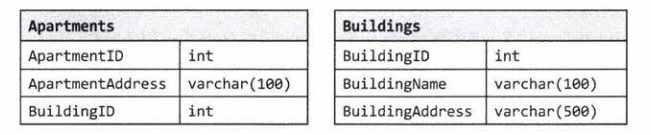
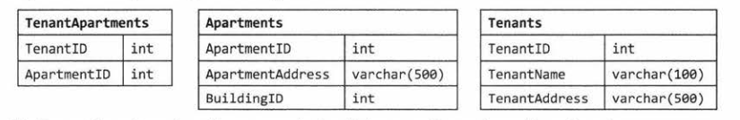
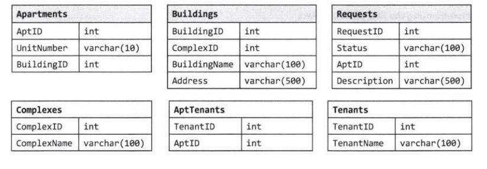
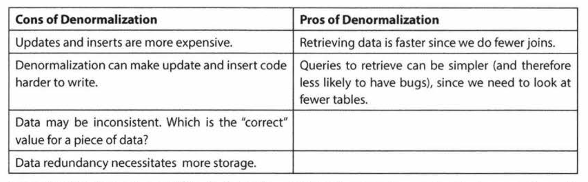

# 14. Databases

# SQL Syntax and Variations
Implicit Join:

```
SELECT CourseName, TeacherName
FROM Courses, Teachers
WHERE Courses.TeacherID = Teachers.TeacherID
```

Explicit Join:
```
SELECT CourseName, TeacherName
FROM Courses INNER JOIN Teachers
ON Courses.TeacherID = Teachers.TeacherID
```

These two statements are equivalent. It is just a matter of personal preference.

# Denormalized vs Normalized Databases
Normalized databases are designed to minimize redundancy, while denormalized databases are designed to optimize read time.

In a traditional normalized database with data like Courses and Teachers, Courses might contain a column called TeacherID, which is a foreign key to Teacher. One benefit of this is that information about the teacher is only stored once in the database. The drawback is that many common queries will require expensive joins.

We can avoid joins by denormalizing the database by storing redundant data. For example, if ew knew that we would have to repeat this query often, we might store the teacher's name in the Courses table. Denormalization is commonly used to create highly scalable systems.

# Small Database Design
## Step 1: Handle Ambiguity
Imagine you are asked to design a system to represent an apartment rental agency. First you need to know whether this agency has multiple locations or just one. You should also discuss how general you should be.

## Step 2: Define the Core Objects
Look at the core objects of our system. Each of these core objects typically translates into a table. In this case, they might be Property, Building, Apartment, Tenant, and Manager.

## Step 3: Analyze Relationships
Outlining the core objects should give us a good sense of what the tables should be. How do these tables relate to each other?

If Buildings has a one-to-many relationship with Apartments, then we might represent this as follows:


Note that the Apartments table links back to Buildings with a BuildingID column.

If we want to allow for the possibility that one person rents more than one apartment, we might want to implement a many-to-many relationship as follows:



The TenantApartments table stores a relationship between Tenants and Apartments.

## Step 4: Investigate Actions
Finally, walk through the common actions that will be taken and understand how to store and retrieve the relevant data. We'll need to handle lease terms, moving out, rent payments, etc. Each of these actions requires new tables and columns.

# Large Database Design
When designing a large, scalable database, joins (which are required in the above examples) are generally very slow. Thus, you must *denormalize* your data. Think about how data will be used - you'll probably need to duplicate the data in multiple tables.

# Questions
Questions 1 through 3 refer to the database schema below. Each apartment can have multiple tenants, and each tenant can have multiple apartments. Each apartment belongs to one building, and each building belongs to one complex.



## Question 1: Multiple Apartments: Write a SQL query to get a list of tenants who are renting more than one apartment.
To implement this, we can use the HAVING and GORUP BY clauses and then perform an INNER JOIN with Tenants.
```
SELECT TenantName
FROM Tenants
INNER JOIN
  (SELECT TenantID FROM AptTenants GROUP BY TenantID HAVING count(*) > 1) c
ON Tenants.TenantID = c.TenantID
```
**Note**: Whenever you write a GROUP BY clause, make sure that anything in the SELECT clause is either an aggregate function or contained within the GROUP BY clause.

## Question 2: Open Requests. Write a SQL query to get a list of all buildings and the number of open requests (Requests with status equals 'Open')
This problem uses a straightforward join of Requests and Apartments to get a list of building IDs and the number of open requests. Once we have this list, we can join it again with the Buildings table.
```
SELECT BuildingName, ISNULL(Count, 0) as 'Count'
FROM Buildings
LEFT JOIN
  (SELECT Apartments.BuildingID, count(*) as 'Count'
  FROM Requests INNER JOIN Apartments
  ON Requests.AptID = Apartments.AptID
  WHERE Requests.Status = 'Open'
  GROUP BY Apartments.BuildingID) ReqCounts
ON ReqCounts.BuildingID = Buildings.BuildingID
```
## Question 3: Close All Requests. Building 11 is undergoing a renovation. Implement a query to close all requests from apartments in this building.
Simply update the requests table and set the status to closed.
```
UPDATE Requests
SET Status = 'Closed'
WHERE AptID IN (SELECT AptID FROM Apartments WHERE BuildingID = 11)
```

## Question 4: Joins: What are the different types of joins?
JOIN is used to combine the results of two tables. To perform a JOIN, each of the tables must have at least one field that will be used to find matching records from the other table.
The join type defines which records will go into the result set:
- INNER JOIN: The result set would contain only the data where the criteria match
- OUTER JOIN: An OUTER JOIN will always contain the results of INNER JOIN, but it may also contain some records that have no matching record in the other table.
  - LEFT OUTER JOIN (LEFT JOIN): The result will contain all records from the left table. If not matching records were found in the right table, then its fields will contain the NULL values.
  - RIGHT OUTER JOIN (RIGHT JOIN): The opposite of LEFT JOIN. It will contain every record from the right table and the missing fields from the left table will be NULL.
  - FULL OUTER JOIN: This combines the results of LEFT and RIGHT JOINS. If no matching record was found, then the corresponding result fields will have a NULL value.

## Question 5: Denormalization. What is it? What are the pros and cons?
Denormalization is a database optimization technique in which we add redundant data to one or more tables to avoid costly joins in a relational database.

In a traditional normalized database, we store data in separate logical tables and attempt to minimize redundant data. If a piece of information is changed, we only have to update it in one place. However, if the tables are large, we may spend unnecessarily long time doing joins.



In a system that demands scalability, we use elements of both normalized and denormalized databases.

## Question 7: Design Grade Database: Design a database to store information for students' grades. Provide a SQL query to return a list of the top 10% students, sorted by their GPA
In a simplistic database, we'll have at least 3 objects: Students, Courses, and CourseEnrollment. Students will have at least a student name and ID (and other info). Courses will contain course name and ID (and other info). CourseEnrollment will pair Students and Courses and will also contain a field for CourseGrade.

| Students |  |
|---|---|
| CourseID | int |
| StudentName | varchar(255) |
| Address | varchar(500) |

| Courses |  |
|---|---|
| CourseID | int |
| CourseName | varchar(255) |
| ProfessorID | int |

| CourseEnrollment |  |
|---|---|
| CourseID | int |
| StudentID | int |
| Grade | float |
| Term | int |

We can use SQL Server's TOP ... PERCENT function, but be careful about using it.

This is incorrect:
```
SELECT TOP 10 PERCENT AVG(CourseEnrollment.Grade) AS GPA, CourseEnrollment.StudentID
FROM CourseEnrollment
GROUP BY CourseEnrollment.StudentID
ORDER BY AVG(CourseEnrollment.Grade)
```
The above code will literally return the top 10% of rows, when sorted by GPA. If there are 100 students, and the top 15 students all have 4.0 GPAs, the above function will only return 10 of those students, which is not what we want. We want to include the students who tied for the top 10%.

To correct this issue, we have to first get the GPA cut off.
```
DECLARE @GPACutOff float;
SET @GPACutOff = (SELECT min(GPA) as 'GPAMin' FROM (
  SELECT TOP 10 PERCENT AVG(CourseEnrollment.Grade) as GPA
  FROM CourseEnrollment
  GROUP BY CourseEnrollment.StudentID
  ORDER BY GPA desc
    ) Grades
  );
```

After we have the GPACutOff defined, selecting the students with GPAs higher than this is straightforward.

```
SELECT StudentName, GPA
FROM (SELECT AVG(CourseEnrollment.Grade) AS GPA, CourseEnrollment.StudentID
      FROM CourseEnrollment
      GROUP BY CourseEnrollment.StudentID
      HAVING AVG(CourseEnrollment.Grade) >= @GPACutOff) Honors
INNER JOIN Students ON Honors.StudentID = Student.StudentID
```
Be careful about what implicit assumptions you make. If you look at the above database description, you assumed that each course can only be taught by one professor.

However, you will need to make some assumptions. Which assumptions you make is less important than just recognizing that you made assumptions. Incorrect assumptions can be dealth with as long as they are acknowledged.

Additionally, there's a trade-off between flexibility and complexity. Creating a system in which a course can have multiple professors does increase the database's flexibility, but also increases its complexity.

Make your design reasonably flexible, and state any other assumptions or constraints.
