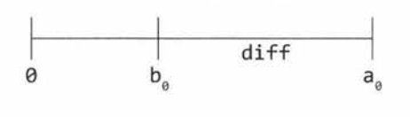

# 16. Additional Questions - Moderate

# Question 1: Number Swapper. Write a function to swap a number in place.
Solution:  
We'll use a0 to indicate the origin^1 v^1ue of a and b0 for the origin^1 v^1ue of b. We'll use diff to indicate the v^1ue of a0-b0.



First, we'll briefly set `a` to `diff`, which is the right side of the above number line. Then, when we add `b` to diff, we'll get a0. We now have b = a0 and a = diff. Then we set a = a0 - diff, which is just b - a.

1. Example for a = 9, b = 4
2. a = a - b; // a = 9 - 4 = 5
3. b = a + b; // b = 5 + 4 = 9
4. a = b - a; // a = 9 - 5 = 4

We can use bit manipulation ^1so. This ^1so works for more data types than just integers.
1. // Example for a = 101 (in binary) and b = 110
2. a = a^b; // a = 101^110 = 011
3. b = a^b; // b = 011^110 = 101
4. a = a^b; // a = 011^101 = 110

# Question 2: Word Frequencies. Design a method to find the frequency of occurrences of any given word in a book. What if we were running this algorithm multiple times?
Solution: Single Query

We simply go through the book, word by word, and count. This will take O(n) time.
```
int getFrequency(String[] book, String word) {
  word = word.trim().toLowerCase();
  int count = 0;
  for (String w : book) {
    if (w.trim().toLowerCase().equals(word)) {
      count++;
    }
  }
  return count;
}
```

Solution: Repetitive Queries

If we're doing the operation repeatedly, we can probably afford to take some time and extra memory to do pre-processing on the book and store it in a hash table so that we can just look it up many times in the future. The frequency of any word can be easily looked up in O(1) time.

```
HashMap<String, Integer> setupDictionary(String[] book){
  HashMap<String, Integer> table = new HashMap<String, Integer>();
  for (String word : book) {
    word = wrod.toLowercase();
    if (word.trim() != "") {
      if (!table.containsKey(word)) {
        table.put(word, 0);
      }
      table.put(word, table.get(word) + 1);
    }
  }
  return table;
}

int getFrequency(HashMap<String, Integer> table, String word) {
  if (table == null || word == null) return -1;
  word = word.toLowerCase();
  if (table.containsKey(word)) {
    return table.get(word);
  }
  return 0;
}
```

## Question 6: Smallest Difference. Given two arrays of integers, compute the pair of values (one value in each array) with the smallest (non-negative) difference. Return the difference.
EXAMPLE  
Input: {1, 3, 15, 11, 2}, {23, 127, 235, 19, 8}  
Output: 3. The pair (11, 8)

**SOLUTION**  
**Brute Force**  
Iterate through all the pairs, compute the difference, and compare it to the current minimum difference.

```
int findSmallestDifference(int[] array1, int[] array2) {
  int min = Integer.MAX_VALUE;
  for (int i = 0; i < array1.length; i++) {
    for (int j = 0; j < array2.length; j++) {
      int difference = Math.abs(array1[i] - array2[j];
      if (difference < min) {
        min = difference;
      }
    }
  }
  return min;
}
```
Time complexity: O(m*n), where m is the length of the first array and n is the length of the second array.

One optimization is that if the minimum is 0, we can just return it since the differences are non-negative.

**Optimal**  
First, sort the arrays. Once the arrays are sorted, we can find the minimum difference by iterating through the array.

Consider:
- A: {1, 2, 11, 15}
- B: {4, 12, 19, 23, 127, 235}

1. Suppose a pointer `a` points to the beginning of A and pointer `b` points to the beginning of B. The current difference is 3. Store this as the min.
2. How can we (potentially) make this difference smaller? Since the value at b is bigger than the value at a, moving the pointer `b` will only make the difference larger. So we move the pointer `a`.
3. Now `a` points to 2 and `b` (still) points to 4. This difference is 2, so we should update min. Move `a`, since it is still smaller.
4. Now `a` points to 11 and `b` points to 4. Move `b`
5. Now `a` points to 11 and `b` points to 12. The difference is 1. Update min to 1. Move `b`

```
int findSmallestDifference(int[] array1, int[] array2) {
  Arrays.sort(array1);
  Arrays.sort(array2);
  int a = 0;
  int b = 0;

  int min = Integer.MAX_VALUE;
  while (a < array1.length && b < array2.length) {
    if (Math.abs(array1[a] - array2[b]) < min) {
      min = Math.abs(array1[a] - array2[b]);
    }
    if (array1[a] < array2[b]) {
      a++;
    } else {
      b++;
    }
  }
  return difference;
}
```

The algorithm takes O(A log A + B log B) time to sort and O(A + B) time to find the minimum. Overall runtime is O(A log A + B log B).

## Question 8: English Integer. Given any integer, print an English phrase that describes the integer (e.g. "One thousand two hundred thirty four")
The key is to be organized in how you approach the problem. Think about converting a big number as converting each of 3-digit segments of the number, inserting millions and thousands as appropriate.

e.g. `convert(19,323,984) = convert(19) + " million " + convert(323) + " thousand " + convert(984)`

```
String[] smalls = {"Zero", "One", "Two", "Three", "Four", "Five", "Six", "Seven",
 "Eight", "Nine", "Ten", "Eleven" , "Twelve", "Thirteen", "Fourteen", "Fifteen" ,
 "Sixteen", "Seventeen", "Eighteen", "Nineteen"};

String[] tens = {"", "", "Twenty", "Thirty", "Forty", "Fifty", "Sixty", "Seventy",
 "Eighty", "Ninety"};
String[] bigs = {"", "Thousand", "Million", "Billion"};
String hundred = "Hundred";
String negative = "Negative";

String convert(int num) {
  if (num == 0) {
    return smalls[0];
  } else if (num < 0) {
    return negative + " " + convert (-1 * num);
  }

  LinkedList<String> parts = new LinkedList<String>();
  int chunkCount = 0;

  while (num > 0) {
    if (num % 1000 != 0) {
      String chunk = convertChunk(num % 1000) + " " + bigs[chunkCount];
      parts.addFirst(chunk);
    }
    num /= 1000; // shift chunk
    chunkCount++;
  }
  return listToString(parts);
}

String convertChunk(int number) {
  LinkedList<String> parts = new LinkedList<String>();

  // convert hundreds place
  if (number >= 100) {
    parts.addLast(smalls[number / 100]);
    parts.addLast(hundred);
    number %= 100;
  }

  // convert tens place
  if (number >= 10 && number <= 19) {
    parts.addLast(smalls[number]);
  } else if (number >= 20) {
    parts.addLast(tens[number / 10]);
    number %= 10;
  }

  // convert ones place
  if (number >= 1 && number <= 9) {
    parts.addLast(smalls[number]);
  }

  return listToString(parts);
}

// Convert a linked list of strings to a string, dividing it up with spaces.
String listToString(LinkedList<String> parts) {
  StringBuilder sb = new StringBuilder();
  while (parts.size() > 1) {
    sb.append(parts.pop());
    sb.append(" ");
  }
  sb.append(parts.pop());
  return sb.toString();
}
```
