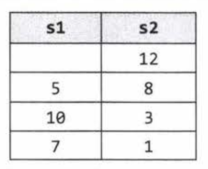

# 3. Stacks and Queues

Questions on stacks and queues will be much easier to handle if you're comfortable with the ins and outs of the data structure.

## Implementing a Stack
A stack uses LIFO (Last-In First-Out) ordering.

It uses the following operations:
- pop(): remove the top of the stack
- push(item): Add an item to the top of the stack
- peek(): return the top of the stack
- isEmpty(): return true if the stack is empty.

Unlike an array, a stack does not offer O(1) time access to the nth item. However, it allows O(1) time adds and removes.

```
public class MyStack<T> {
  private static class StackNode<T> {
    private T data;
    private StackNode<T> next;

    public StackNode(T data) {
      this.data = data;
    }
  }

  private StackNode<T> top;

  public T pop() {
    if (top == null) throw new EmptyStackException();
    T item = top.data;
    top = top.next;
    return item;
  }

  public void push(T item) {
    StackNode<T> t = new StackNode<T>(item);
    t.next = top;
    top = t;
  }
  public T peek() {
    if (top == null) throw new EmptyStackException();
    return top.data;
  }

  public boolean isEmpty() {
    return (top == null);
  }
}
```
One case where stacks are often useful is in certain recursive algorithms. Sometimes you need to push temporary data onto a stack as you recurse, but then remove them as you backtrack.

## Implementing a Queue
FIFO (First-In First-Out) ordering.

It uses the operations:
- add(item): add an item to the end of the list
- remove(): remove the first item in the list
- peek(): return the first item in the list
- isEmpty(): return true if the queue is empty

```
public class MyQueue<T> {
  private static class QueueNode<T> {
    private T data;
    private QueueNode<T> next;

    public QueueNode(T data){
      this.data = data;
    }
  }

  private QueueNode<T> first;
  private QueueNode<T> last;

  public void add(T item){
    QueueNode<T> newNode = new QueueNode<T>(item);
    if (last != null){
      last.next = newNode;
    }
    last = newNode;
    if (first == null) {
      first = last;
    }
  }

  public T remove() {
    if (first == null) throw new NoSuchElementException();
    T item = first.data;
    first = first.next;
    if (first == null) {
      last = null;
    }
    return item;
  }

  public T peek(){
    if (first == null) throw new NoSuchElementException();
    T item = first.data;
    return item;
  }

  public boolean isEmpty() {
    return first == null;
  }
}
```
**Important**: It is especially easy to mess up the updating of the first and last nodes in a queue.

Queues are often used in breadth-first search or in implementing a cache.

For example, in BFS, we use a queue to store a list of the nodes that we need to process. Each time we process a node, we add its adjacent nodes to the back of the queue.

# Questions
## Question 1: Three in One: Describe how you could use a single array to implement three stacks.
Approach 1: Fixed Division.  
Assuming that we're okay with simply allocating a fixed amount of space for each stack, we can divide the array in 3 equal parts and allow the individual stack to grow in that limited space.
- For stack 1, we will use [0, n/3).
- For stack 2, we will use [n/3, 2n/3).
- For stack 3, we will use [2n/3, n).

Approach 2: Flexible Divisions (far more complex than would be appropriate for an interview).   
When one stack exceeds its initial capacity, we grow the allowable capacity and shift elements as necessary.

We will also design our array to be circular, such that the final stack may start at the end of the array and wrap around.  

`Refer to book page 229 - 231 for the full code implementation`

## Question 2: Design a stack which, in addition to `push` and `pop`, has a `min` function that returns the minimum element. `Push`, `pop` and `min` should operate in `O(1)` time.
SOLUTION  
Notice that minimums only change when a smaller element is added.

One solution is to have a single int value, minValue, that is a member of the Stack class. However, when minValue is popped from the stack, we have to search for a new minimum. This might break the O(1) constraint.

This leads to the second solution:

If we kept track of the minimum at each state, we would be able to easily know the minimum. We can do this by having each node record what the minimum beneath itself is. Then, to find the min, just look at what top element thinks is the min.

We create a new wrapper class that contains its value and the minValue it has seen so far.

When you push an element onto the stack, the element is given the current minimum. It sets its "local min" to be the min.

```
public class StackWithMin extends Stack<NodeWithMin> {
  public void push(int value) {
    int newMin = Math.min(value, min());
    super.push(new NodeWithMin(value, newMin));
  }

  public int min() {
    if (this.isEmpty()) {
      return Integer.MAX_VALUE;
    } else {
      return peek().min;
    }
  }
}

class NodeWithMin {
  public int value;
  public int min;
  public NodeWithMin(int v, int min){
    value = v;
    this.min = min;
  }
}
```
The issue with this approach is that we waste a lot of space by keeping track of the min in every single element. Can we do better?

We can do a bit better ty using an additional stack which keeps track of the mins only.

```
public class StackWithMin extends Stack<Integer> {
  Stack<Integer> s2;
  public StackWithMin() {
    s2 = new Stack<Integer>();
  }

  public void push (int value) {
    if (value <= min()){
      s2.push(value);
    }
    super.push(value);
  }

  public Integer pop(){
    int value = super.pop();
    if (value == min()) {
      s2.pop();
    }
    return value;
  }

  public int min() {
    if (s2.isEmpty())
      return Integer.MAX_VALUE;
    else
      return s2.peek();
  }
}
```

## Question 3: Implement a data structure SetOfStacks. SetOfStacks should be composed of several stacks and should create a new stack once the previous one exceeds capacity.

We've been told what our data structure should look like:
```
class SetOfStacks {
  ArrayList<Stack> stack = new ArrayList<Stack>();

  public void push(int v) {
    Stack last = getLastStack();
    if (last != null && !last.isFull()) {
      last.push(v);
    } else {
      Stack stack = new Stack(capacity);
      stack.push(v);
      stacks.add(stack);
    }
  }

  public int pop() {
    Stack last = getLastStack();
    if (last != null) {
      int v = last.pop();
    }
    if (last.size == 0){
      stacks.remove(stacks.size() - 1); // remove the last stack if it's empty after pop.
    }
    return v;
  }
}
```

FOLLOW UP: Implement popAt(int index) which performs a pop operation on a specific sub-stack.  

A good strategy on problems like this is to separate code into other methods, like a `leftShift` method that popAt can call.

```
public int leftShift(int index, boolean removeTop) {
  Stack stack = stacks.get(index);
  int removed_item;

  if(removeTop) removed_item = stack.pop();
  else removed_item = stack.removeBottom();

  if (stack.isEmpty()) {
    stacks.remove(index);
  } else if (stacks.size() > index + 1) {
    int v = leftShift(index + 1, false);
    stack.push(v);
  }
  return removed_item;
}
```

## Question 4: Implement a MyQueue class which implements a queue using two stacks.
Since the major difference between a queue and a stack order (FIFO and LIFO), we need to modify peek() and pop() to go in reverse order.

We can use our second stack to reverse the order of the elements (by popping s1 and pushing the elements on to s2). We can implement a lazy approach where we let the elements sit in s2 until we must reverse the elements.

stackNewest has the newest elements on top and stackOldest has the oldest elements on top. When we dequeue an element, we want to remove the oldest element first, so we dequeue from stackOldest. If stackOldest is empty, we want to transfer all elements from stackNewest into this stack in reverse order.

```
public class MyQueue<T> {
  Stack<T> stackNewest, stackOldest;

  public MyQueue {
    stackNewest = new Stack<T>();
    stackOldest = new Stack<T>();
  }

  public int size() {
    return stackNewest.size() + stackOldest.size();
  }

  public void add(T value) {
    stackNewest.push(value);
  }

  private void shiftStacks() {
    if (stackOldest.isEmpty()) {
      while (!stackNewest.isEmpty()) {
        stackOldest.push(stackNewest.pop());
      }
    }
  }

  public T peek(){
    shiftStacks();
    return stackOldest.peek();
  }

  public T remove() {
    shiftStacks();
    return stackOldest.pop();
  }
}
```

## Question 5: Sort Stack. Write a program to sort a stack such that the smallest items are on the top. You can use an additional temporary stack, but you may not copy the elements into any other data structure. The stack supports `push`, `pop`, `peek`, and `isEmpty`.

SOLUTION:   
Approach #1: Implement a rudimentary sorting algorithm. We search through the entire stack to find the minimum element and then push that into a new stack. This will require a total of 3 stacks: s1 original stack, s2 final sorted stack, s3 buffer during our searching of s1.

Unfortunately, we can only use one additional stack.

Rather than searching for the minimum repeatedly, we can sort s1 by inserting each element from s1 in order to s2.

When we pop from s1, we need to find the right place in s2 to insert this number.



In this case, we pop 5 from s1 and hold it in a temporary variable. Then we move 12 and 8 to s1 (by popping them from s2 and pushing them to s1) and then push 5 onto s2. Repeat the same steps for the rest of the elements in s1.

```
void sort(Stack<Integer> s1){
  Stack<Integer> s2 = new Stack<Integer>();
  while(!s1.isEmpty()){
    int tmp = s1.pop();
    while (!s2.isEmpty() && s2.peek() > tmp){
      s1.push(s2.pop());
    }
    s2.push(tmp);
  }
  while (!s2.isEmpty()){
    s1.push(s2.pop());
  }
}
```
Time Complexity: `O(N^2)`. Space Complexity: `O(N)`
