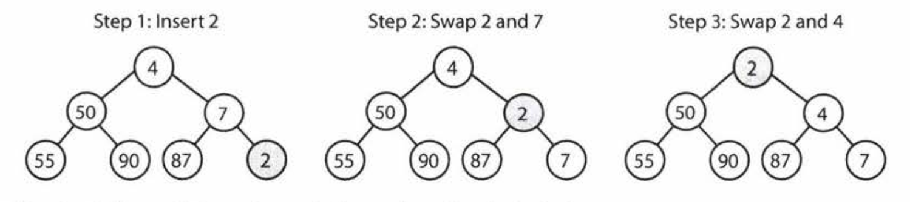
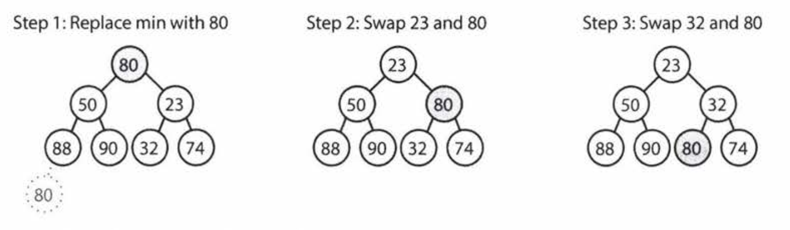
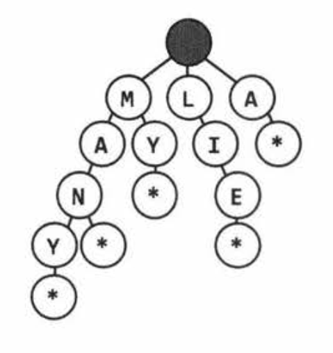
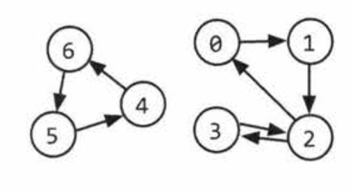
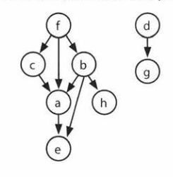

# 4. Trees and Graphs

# Types of Trees
A tree is a data structure composed of nodes.
- Each tree has a root node
- The root node has 0 or more child nodes
- Each child node has 0 or more child nodes, and so on

The tree cannot contain cycles. The nodes may or may not be in a particular order, they could have any data type as values, and they may or may not have links back to their parent nodes.

A very simple class definition for Node is:
```
class Node {
  public String name;
  public Node[] children;
}
```

You might also have a Tree class to wrap this node. For the purposes of interview questions, we typically do not use a Tree class.
```
class Tree {
  public Node root;
}
```
Tree and graph questions are rife with ambiguous details and incorrect assumptions. Be sure to watch out for the following issues and seek clarification where necessary.

## Trees vs. Binary Trees
A binary tree is a tree in which each node has up to two children. **Not all trees are binary trees.**

## Binary Tree vs. Binary Search Tree
A binary search tree is a binary tree in which **every node fits a specific ordering property**: all left descendants <= n < all right descendants. This must be true for each node n.
Be sure to ask whether it is a binary tree or binary search tree.

## Balanced vs. Unbalanced
Not all trees are balanced. A tree is balanced enough to ensure `O(log n)` time for `insert` and `find`. Two common balanced trees are red-black trees and AVL trees.

## Complete Binary Trees
A complete binary tree is a binary tree in which every level of the tree is fully filled, except perhaps the last level. To the extent that the last level is filled, it is filled left to right.

## Full Binary Trees
A full binary tree is a binary tree in which every node has only either zero or two children.

## Perfect Binary Tree
A perfect binary tree is one that is both full and complete. All leaf nodes will be at the same level, and this level has the maximum number of nodes. A perfect tree has exactly 2^k - 1 nodes, where k is the number of levels.

# Binary Tree Traversal
You should be comfortable implementing in-order, post-order and pre-order traversal. Most common of these is in-order traversal.

## In-Order Traversal
Means to "visit" the left branch, then the current node, then the right branch. When performed on a binary search tree, it visits the nodes in ascending order.

```
void inOrderTraversal(TreeNode node){
  if (node != null){
    inOrderTraversal(node.left);
    visit(node);
    inOrderTraversal(node.right);
  }
}
```

## Pre-Order Traversal
Means to "visit" the current node before its children nodes. The root is always the first node visited.
```
void preOrderTraversal(TreeNode node){
  if (node != null){
    visit(node);
    preOrderTraversal(node.left);
    preOrderTraversal(node.right);
  }
}
```

## Post-Order Traversal
Visits the current node after its children nodes. The root node is always the last node visited.
```
void postOrderTraversal(TreeNode node){
  if (node != null){
    postOrderTraversal(node.left);
    postOrderTraversal(node.right);
    visit(node);
  }
}
```

# Binary Heaps (Min-Heaps and Max-Heaps)
We'll just discuss min-heaps here. Max-heaps are essentially equivalent, but the elements are in descending order rather than ascending order.  
A min-heap is a complete binary tree. The root is the minimum element in the tree.

Two key operations on a min-heap: insert and extract-min

*Insert*  
When we insert into a min-heap, we always start by inserting the element at the bottom. We insert at the rightmost spot so as to maintain the complete tree property. Then we "fix" the tree by swapping the new element with its parent until we find an appropriate spot for the element.



This takes `O(log n)` time, where n is the number of nodes in the heap.

*Extract-Min*  
It's always at the top. The tricky part is how to remove it.

First, remove the minimum element and swap it with the last element in the heap (bottom, rightmost element). Then, we bubble down this element, swapping it with one of its children until the min-heap property is restored. Since there's no inherent ordering between the left and right child elements, you'll need to take the smaller one in order to maintain the min-heap ordering.



This takes `O(log n)` time, where n is the number of nodes in the heap.

# Tries (Prefix Trees)
A trie is a variant of an n-ary tree in which characters are stored at each node. Each path down the tree may represent a word.

The * nodes (null nodes) are often used to indicate complete words. For example, the fact that there is a * node under MANY indicates that MANY is a complete word.

The actual implementation of these * nodes might be a special type of child (such as a TerminatingTrieNode which inherits from TrieNode). Or, we could use just a boolean flag terminates within the parent node.

A node in a trie could have anywhere from 1 through ALPHABET_SIZE (+ 1 children assuming we are including * node)



Very commonly, a trie is used to store the entire language for quick prefix lookups. While a hash table can quickly look up whether a string is a valid word, it cannot tell us if a string is a prefix of any valid words. A trie can do this very quickly.

A trie can check if a string is valid in O(K) time, where K is the length of the string. This is the same runtime as a hash table will take. Although we often refer to hash table lookups as being O(1) time, this isn't entirely true. A hash table must read through all the characters in the input, which takes O(K) time in the case of a word lookup.

# Graphs
A tree is actually a type of graph, but not all graphs are trees. A tree is a connected a graph without cycles.



A graph is simply a collection of nodes with edges between (some of) them.
- Graphs can either be directed or undirected
- The graph might consist of multiple isolated subgraphs. If there is a path between every pair of vertices, it's called a connected graph.
- The graph can also have cycles. (Cyclic or acyclic)

There are two common ways to represent a graph:
## Adjacency List
Most common way to represent a graph. Every vertex (node) stores a list of adjacent vertices. In an undirected graph, an edge like (a, b) would be stored twice: once in a's adjacent vertices and once in b's adjacent vertices.

A simple class definition for a graph node could look essentially the same as a tree node.

```
class Graph {
  public Node[] nodes;
}

class Node {
  public String name;
  public Node[] children;
}
```
The Graph is used because, unlike in a tree, you can't necessarily reach all the nodes from a single node.

An array (or a hash table) of lists can store the adjacency list. The graph above could be represented as:
```
  0: 1
  1: 2
  2: 0, 3
  3: 2
  4: 6
  5: 4
  6: 5
```

## Adjacency Matrices
An adjacency matrix is an NxN boolean matrix where a true value at matrix[i][j] indicates an edge from node i to node j (also can use 0s and 1s).

In an undirected graph, an adjacency matrix will be symmetric.

The same graph algorithms that are used on adjacency lists (BFS, etc.) can be performed with adjacency matrices, but they may be less efficient. In the adjacency list representation, you can easily iterate through the neighbors of a node. In the adjacency matrix representation, you will need to iterate through all the nodes to identify a node's neighbors.

## Graph Search (specifically, DFS, BFS)
DFS and BFS tend to be used in different scenarios. DFS is often preferred if we want to visit every node in the graph. Both will work, but DFS implementation is a bit simpler.

If we want to find the shortest path (or just any path) between 2 nodes, BFS is generally better.

### DFS
Note that pre-order and other forms of tree traversal are a form of DFS. The key difference is that when implementing this algorithm for a graph, we must check if the node has been visited. If we don't, we risk getting stuck in an infinite loop.

*Pseudocode for DFS*
```
void DFS(Node root){
  if (root == null) return;
  visit(root);
  root.visited = true;

  for (Node n : root.adjacent) {
    if (n.visited == false){
      DFS(n);
    }
  }
}
```

### BFS
BFS is a bit less intuitive, and many interviewees struggle with the implementation. The main tripping point is the (false) assumption that BFS is recursive. It's not. Instead **it uses a queue**.

In BFS, node n visits each of n's neighbors before visiting any of their neighbors. You can think of this as searching level by level out from a. A solution involving a queue usually works best.
*Pesudocode for BFS*
```
void BFS(Node root) {
  Queue queue = new Queue();
  root.visited = true;

  queue.enqueue(root);

  while (!queue.isEmpty()) {
    Node r = queue.dequeue();
    visit(r);

    for (Node n in r.adjacent) {
      if (n.visited == false) {
        n.visited = true;
        queue.enqueue(n);
      }
    }
  }
}
```

**Remember to use queue.**

### Bidirectional Search
Bidirectional search is used to find the shortest path between 2 nodes. It operates by running two simultaneous BFS, one from each node. When their searches collide, we have found a path.

Consider a graph where every node has at most `k` adjacent nodes and the shortest path from node `s` to node `t` has length `d`.
- In traditional BFS, we would search up to k nodes in the first "level" of the search. In the second level, we would search up to k nodes for each of those first k nodes. We would do this d times, so that's `O(k^d)`.
- In bidirectional search, we have two searches collide after approximately d/2 levels (the midpoint of the path). The search from s visits approximately `k^(d/2)` nodes, as does the search from t. In total, that's 2*k^(d/2), or `O(k^(d/2))`.

The bidirectional search is faster by a factor of k^(d/2).

# Questions
## Question 1: Route Between Nodes. Given a directed graph, design an algorithm to find out whether there is a route between two nodes.
This problem can be solved by simple graph traversal. Don't forget to mark any node found as visited to avoid infinite loop.

This is an iterative implementation of BFS
```
enum State { Unvisited, Visited, Visiting; }

boolean BFS(Graph g, Node start, Node end){
  if (start == end) return true;

  // Queue
  LinkedList<Node> queue = new LinkedList<Node>();

  for (Node u : g.getNodes()) {
    u.state = State.Unvisited; // Initial mark everything as unvisited
  }

  start.state = State.Visiting;

  queue.add(start);

  Node u;
  while (!queue.isEmpty()) {
    u = q.removeFirst(); // Dequeue
    if (u != null) {
      for (Node v : u.getAdjacent()) {
        if (v.state == State.Unvisited) {
          if (v == end) {
            return true;
          } else {
            v.state = State.Visiting;
            queue.add(v);
          }
        }
      }
      u.state = State.Visited;
    }
  }
  return false;
}
```

*DFS implementation*
```
void DFS(Graph g, Node start, Node end){
  if (start == end) return true;
  start.visited = true;

  for (Node n : start.getAdjacent()){
    if (n.visited == false){
      if (n == end) {
        return true;
      } else {
        n.visited = true;
        DFS(g, n, end);
      }
    }
  }
}
```

DFS is a bit simpler to implement since it can be done with simple recursion.

## Question 2: Minimal Tree. Given a sorted (increasing order) array with unique integer elements, write an algorithm to create a binary search tree with minimal height.
To create a tree of minimal height, we need to match the number of nodes in the left subtree and right subtree. This means that we want the root to be the middle of the array.

One way to implement this is to use a `root.insertNode(int v)` method which inserts the value `v` through a recursive process that starts with the root node. While this constructs a tree with minimal height, it is not very efficient. Each insertion will require traversing the tree, giving a total cost of `O(N log N)` to the tree.

Alternatively, we can cut out the extra traversals by recursively using the `createMinimalBST` method. This method is passed just a subsection of the array and returns the root of a minimal tree for that array.

The algorithm is as follows:
1. Insert into the tree the middle element of the array.
2. Insert into the left subtree the left subarray elements.
3. Insert into the right subtree the right subarray elements.
4. Recurse.

```
TreeNode createMinimalBST(int[] array){
  return createMinimalBST(array, 0, array.length - 1);
}

TreeNode createMinimalBST(int[] array, int start, int end){
  if (end < start){
    return null;
  }
  int mid = (start + end) / 2;
  TreeNode n = new TreeNode(arr[mid]);

  n.left = createMinimalBST(arr, start, mid - 1);
  n.right = createMinimalBST(arr, mid + 1, end);
  return n;
}
```

## Question 3: List of Depths. Given a binary tree, design an algorithm which creates a linked list of all the nodes at each depth (if you have a tree with depth D, you'll have D linked lists).

We can implement a simple modification of the pre-order traversal algorithm where we pass in `level + 1` to the next recursive call.

*DFS Implementation*

```
void createLevelLinkedList(TreeNode root, ArrayList<LinkedList<TreeNode>> lists, int level) {
  if (root == null) return; // base case

  LinkedList<TreeNode> list = null;
  if (lists.size() == level) { // Level not contained in list
    list = new LinkedList<TreeNode>();
    /* Levels are always traversed in order. So if this is the first time we've visited level i,
     * we must have seen levels 0 through i - 1. */
    lists.add(list);
  } else {
    list = lists.get(level);
  }
  list.add(root);
  createLevelLinkedList(root.left, lists, level + 1);
  createLevelLinkedList(root.right, lists, level + 1);
}

ArrayList<LinkedList<TreeNode>> createLevelLinkedList(TreeNode root) {
  ArrayList<LinkedList<TreeNode>> lists = new ArrayList<LinkedList<TreeNode>>();
  createLevelLinkedList(root, lists, 0);
  return lists;
}
```

Alternatively, we can use BFS. With each level i, we will have already fully visited all nodes on level i - 1.

*BFS Implementation*
```
ArrayList<LinkedList<TreeNode>> createLevelLinkedList(TreeNode root) {
  ArrayList<LinkedList<TreeNode>> result = new ArrayList<LinkedList<TreeNode>>();

  // Visit the root
  LinkedList<TreeNode> current = new LinkedList<TreeNode>();
  if (root != null) {
    current.add(root);
  }
  while (current.size() > 0) {
    result.add(current); // Add previous level
    LinkedList<TreeNode> parents = current; // Go to the next level
    current = new LinkedList<TreeNode>();

    for (TreeNode parent : parents) {
      // Visit the children
      if (parent.left != null) {
        current.add(parent.left);
      }
      if (parent.right != null) {
        current.add(parent.right);
      }
    }
  }
  return result;
}
```

Both solutions run in `O(N)` time and `O(N)` space.

## Question 4: Check Balanced. Check if a binary tree is balanced. Balanced mean the height of the two subtrees of any node never differ by > 1.
We can simply recurse through the entire tree and for each tree, compute the height of each subtree.

```
int getHeight(TreeNode root) {
  if (root == null) return -1; // base case
  return Math.max(getHeight(root.left), getHeight(root.right)) + 1;
}

boolean isBalanced(TreeNode root) {
  if (root == null) return true; // base case

  int heightDiff = getHeight(root.left) - getHeight(root.right);

  if(Math.abs(heightDiff) > 1) {
    return false;
  } else { // recurse
    return isBalanced(root.left) && isBalanced(root.right);
  }
}
```

This works, but not very efficient. On each node, we recurse through its entire subtree. This means that `getHeight` is called repeatedly on the same nodes. This algorithm is `O(N log N)` since each node is "touched" once per node above it.

We need to cut out some of the calls to `getHeight`.

If we inspect this method, we may notice that `getHeight` could actually check if the tree is balanced at the same time. If the subtree is not balanced, the `checkHeight` will return an error code.

```
int checkHeight(TreeNode root) {
  if (root == null) return -1; // base case

  int leftHeight = checkHeight(root.left);
  if (leftHeight == Integer.MIN_VALUE) return Integer.MIN_VALUE; // Pass error up

  if rightHeight = checkHeight(root.right);
  if (rightHeight == Integer.MIN_VALUE) return Integer.MIN_VALUE; // Pass error up

  int heightDiff = leftHeight - rightHeight;

  if (Math.abs(heightDiff) > 1) {
    return Integer.MIN_VALUE; // Found error --> pass it back
  } else {
    return Math.max(leftHeight, rightHeight) + 1;
  }
}

boolean isBalanced(TreeNode root) {
  return checkHeight(root) != Integer.MIN_VALUE;
}
```

This code runs in `O(N)` time and `O(H)` space, where H is the height of the tree.

## Question 5: Implement a function to check if a binary tree is a binary search tree.
We can implement this solution in two different ways. The first leverages in the in-order traversal and the second builds off the property that left <= current < right.

### Solution 1: In-Order Traversal
Initial thought: Traverse the tree, copy the values to an array and check if array is sorted. However, this might not work if the tree has duplicate values.

Upon further inspection, we find that the array is not actually necessary. We can just track the last element we saw and compare it as we go.

```
Integer last_printed = null;
boolean checkBST(TreeNode n) {
  if (n == null) return true;

  // Check / recurse left
  if (!checkBST(n.left)) return false;

  // Check current
  if (last_printed != null && n.data <= last_printed){
    return false;
  }
  last_printed = n.data;

  // Check / recurse right
  if (!checkBST(n.right)) return false;

  return true;
}
```

### Solution 2: The Min/Max Solution
By definition, it must satisfy the condition left.data <= current.data < right.data for each node. Also, ALL left nodes must be <= the current node <= ALL right nodes.

We start with a range of (min = NULL, max = NULL). We branch left, checking that these nodes are within the range (min = NULL, max = 20). Then, we branch right, checking that the nodes are within the range (min = 20, max = NULL).

When we branch left, the max gets updated. When we branch right, the min gets updated. If anything fails, stop and return false.

The time complexity for this solution is O(N), where N is the number of nodes in the tree. This is the best that we can do since any algorithm must touch all N nodes.

Space complexity is O(log N) on a balanced tree. There are up to O(log N) recursive calls on the stack since we may recurse up to the depth of the tree.

```
boolean checkBST(TreeNode n) {
  return checkBST(n, null, null);
}

boolean checkBST(TreeNode n, Integer min, Integer max){
  if (n == null) return true;

  if ((min != null && n.data <= min) || (max != null && n.data > max)) {
    return false;
  }

  if (!checkBST(n.left, min, n.data) || !checkBST(n.right, n.data, max)) {
    return false; // if any of the recursed call returns false, return false.
  }
  return true;
}
```

Remember that in recursive algorithms, make sure that your base cases, as well as your null cases are well handled.

## Question 7: Build Order. You are given a list of projects and a list of dependencies (list of pairs of projects, where the second project is dependent on the first project). Find the build order. If there isn't a valid build order, return error.

EXAMPLE:
Input:   
Projects: a, b, c, d, e, f  
dependencies: (a, d), (f, b), (b, d), (f, a), (d, c)   
Output: f, e, a, b, d, c

**SOLUTION**  
1. We first added the nodes with no incoming edges. If the set of projects can be built, there must be some "first" project, and that project can't have any dependencies. If a project has no dependencies (incoming edges), then we certainly can't break anything by building it first.
2. We removed all outgoing edges from these roots. This is reasonable. Once those root projects were built, it doesn't matter if another project depends on them.
3. After that, we found the nodes that now have no incoming edges. Using the same logic from steps 1 and 2, it's okay if we build these. Now we just repeat the same steps: find the nodes with no dependencies, add them to the build order, remove their outgoing edges, and repeat.
4. What if there are nodes remaining, but all have dependencies (incoming edges)?This means there's no way to build the system. We should return an error.

The implementation:  
Initialization and setup:
1. Build a graph where each project is a node and its outgoing edges represent the projects that depend on it. Each node also tracks the number of incoming edges.
2. Initialize an array. We also continue to iterate through the array, using a pointer to point to the next node to be fully processed.
3. Find all the nodes with 0 incoming edges and add those to the array. Set a pointer to the beginning of the array.

Repeat until the pointer is at the end of the array:
1. Read node at pointer
  - if node is null, then all remaining nodes have a dependency and we have detected a cycle.
2. For each child of node:
  - Decrement child.dependencies
  - if child.dependencies is 0, add child to end of array
3. Move pointer 1 step

`Refer to pages 252 - 254 for code implementation`

**SOLUTION #2**  
We can use DFS to find the build path. Suppose we pick an arbitrary node and perform a DFS on it. When we get to the end of the path and can't go any further, we know that those terminating nodes can be the last projects to be built. No projects depend on them.

Let's use this example:



```
DFS(b)
  DFS(h)
    build order = ..., h
  DFS(a)
    DFS(e)
      build order = ..., e, h
    ...
  ...
```
We know a's children need to appear after a in the build order. So, once we return from searching a's children, we can choose to add a to the front of the build order.

```
DFS(b)
  DFS(h)
    build order = ..., h
  DFS(a)
    DFS(e)
      build order = ..., e, h
    build order = ..., a, e, h
  DFS(e) -> return
  build order = ..., b, a, e, h
```
Mark these nodes as having been built too.

We should think about the issue of cycles. There is no possible build order if there is a cycle. A cycle will happen if, while doing a DFS on a node, we run back into the same path. What we can do is to mark each node as "visiting" state just before we start the DFS on it.

```
Stack<Project> findBuildOrder(String[] projects, String[][] dependencies){
  Graph graph = buildGraph(projects, dependencies);
  return orderProjects(graph.getNodes());
}

Stack<Project> orderProjects(ArrayList<Project> projects){
  Stack<Project> stack = new Stack<Project>();
  for (Project project : projects) {
    if (project.getState() == Project.State.BLANK) {
      if (!doDFS(project, stack)) {
        return null;
      }
    }
  }
  return stack;
}

boolean doDFS(Project project, Stack<Project> stack){
  if (project.getState() == Project.State.VISITING) {
    return false; // cycle
  }

  if (project.getState() == Project.State.BLANK) {
    project.setState(Project.State.VISITING);
    ArrayList<Project> children = project.getChildren();

    for (Project child : children) {
      if (!doDFS(child, stack)) {
        return false;
      }
    }
    project.setState(Project.State.COMPLETE);
    stack.push(project);
  }
  return true;
}

Graph buildGraph(String[] projects, String[][] dependencies){
  Graph graph = new Graph();
  for (String project : projects){
    graph.getOrCreateNode(project);
  }

  for (String[] dependency : dependencies) {
    String first = dependency[0];
    String second = dependency[1];
    graph.addEdge(first, second);
  }
  return graph;
}

public class Graph {
  private ArrayList<Project> nodes = new ArrayList<Project>();
  private HashMap<String, Project> map = new HashMap<>();

  public Project getOrCreateNode(String name){
    if (!map.containsKey(name)){
      Project node = new Project(name);
      nodes.add(node);
      map.put(name, node);
    }
    return map.get(name);
  }

  public void addEdge(String startName, string endName){
    Project start = getOrCreateNode(startName);
    Project end = getOrCreateNode(endName);
    start.addNeighbor(end);
  }
}

public class Project { ... }
```

This solution is O(P+D) time, where P is the number of projects and D is the number of dependency pairs.

This problem is called **topological sort**.

## Question 8: First Common Ancestor: Design an algorithm to find the first common ancestor of 2 nodes in a binary tree. This is not necessarily a Binary Search Tree.
Solution #1:   
If each node has a link to its parent, we could trace p and q's paths up until they intersect. We can first find the difference in depths and move the deeper node up. Then, we can keep calling p.parent and q.parent and check if they are identical (or not!)

This approach will take O(d) time, where d is the depth of the deeper node.

## Question 10: Check Subtree. Check if T2 is a subtree of T1.
**The simple approach**  
We can store NULL nodes in the pre-order traversal string as a special character, then the pre-order traversal of a tree is unique.

Now, we just have to do a pre-order traversal for both T1 and T2 and compare them.

This approach takes O(n + m) time and O(n + m) space, where n and m are the number of nodes in T1 and T2.

**Alternatively**  
Search through the larger tree. Each time a node in T1 matches the root of T2, call matchTree, which will compare the two subtrees if they're identical.

1. The simple solution takes O(n + m) memory. The alternative solution takes O(log(n) + log(m)) memory.
2. The simple solution takes O(n + m) time. The alternative solution has a worst case time of O(nm) **or slightly tighter, O(n + km)**.

## Question 12: Paths with Sum. Given a binary tree in which each node contains an integer value, design an algorithm to count the number of paths that sum to a given value. The path does not need to start or end at the root or a leaf.
We traverse through the tree using DFS. As we visit each node:
1. Track its runningSum. We'll take this in as a parameter and immediately increment it by node.value.
2. Look up runningSum - targetSum in the hash table. The value there indicates the total number. Set totalPaths to this value.
3. If runningSum == targetSum, increment totalPaths.
4. Add runningSum to the hash table (or increment the value if it's already there)
5. Recurse left and right, counting the number of paths with sum targetSum.
6. After we're done recursing left and right, decrement the value of runningSum in the hash table. It reverses the changes to the hash table so that other nodes don't use it.


The runtime is O(N), where N is the number of nodes in the tree. It's O(N) because we travel to each node just once, doing O(1) work each time. In a balanced tree, the space complexity is O(log N) due to the hash table, and can grow to O(n) in an unbalanced tree.
