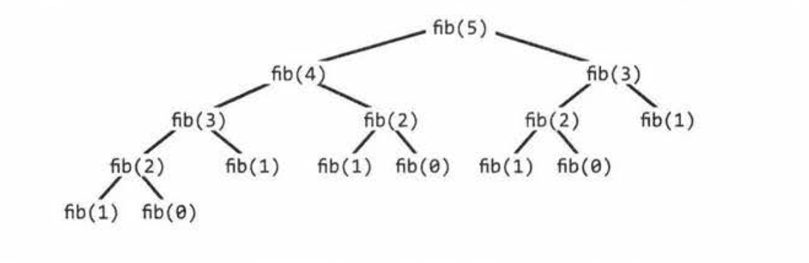
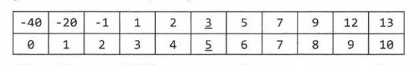
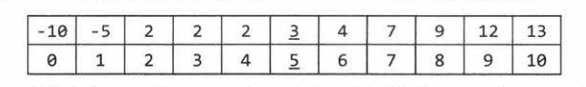

# 8. Recursion and Dynamic Programming

When you hear a problem beginning with the following statements, it's often a good candidate for recursion: "design an algorithm to compute the nth...", "write code to list the first n...", "implement a method to compute all...", etc.

## How to Approach
Recursive solutions are built off of solutions to subproblems. Many times, this will mean simply to compute f(n) by adding something, removing something, or otherwise changing the solution for f(n - 1).

There are many ways you might divide a problem into subproblems. Three of the most common approaches are bottom-up, top-down, and half-half.

### Bottom-Up Approach
We start with knowing how to solve the problem for a simple case (e.g. a list with only 1 element). Then, we figure out how to solve the problem for 2 elements, then three, and so on.

The key here is to think about how you can *build* the solution for one case off of the previous case.

### Top-Down Approach
We think about how we can divide the problem for case N into subproblems (be careful of overlap between the cases!)

### Half-Half Approach
For example, binary search, merge-sort, etc.

## Recursive vs. Iterative Solutions
Recursive algorithms can be very space inefficient. Each recursive call adds a new layer to the stack.

For this reason, it's often better to implement a recursive algorithms iteratively. *All* recursive algorithm can be implemented iteratively, although sometimes the code to do so is much more complex.

## Dynamic Programming & Memoization
Dynamic Programming is mostly just a matter of taking a recursive algorithm and finding the overlapping subproblems (that is, the repeated calls). You can then cache those results for future recursive calls.

One of the simplest examples of DP is computing the nth Fibonacci number. A good approach to such problem is often to implement it as a normal recursive solution and then add the caching part.

### Fibonacci Numbers
#### Approach 1: Recursive

```
int fibonacci(int i) {
  if (i == 0) return 0;
  if (i == 1) return 1;
  return fibonacci(i-1) + fibonacci(i-2);
}
```
Time complexity: `O(2^n)`


#### Approach 2: Memoization (Top-Down DP)
If you study the recursion tree, there are lots of identical nodes. When we call fib(n), we shouldn't have to do much more than O(n) calls, since there's only O(n) possible values we can throw at fib. Each time we compute fib(i), we should cache this result and use it later (memoization).

```
int fibonacci(int n){
  return fibonacci(n, new int[n + 1]);
}

int fibonacci(int i, int[] memo) {
  if (i == 0 || i == 1) return 1;

  if (memo[i] == 0) {
    memo[i] = fibonacci(i - 1, memo) + fibonacci(i - 2, memo);
  }

  return memo[i];
}
```
Time complexity: `O(n)`

#### Approach 3: Bottom-Up DP
First, we compute fib(0) and fib(1), which are already known base cases. Then we use those to compute fib(2), then fib(3), and so on.

```
int fibonacci(int n) {
  if (n == 0) return 0;
  else if (n == 1) return 1;

  int[] memo = new int[n];

  memo[0] = 0;
  memo[1] = 1;

  for (int i = 2; i < n; i++){
    memo[i] = memo[i - 1] + memo[i - 2];
  }
  return memo[n];
}
```

Although, if you think about it, you only use memo[i] for memo[i + 1] and memo[i + 2]. We don't need it after that. So, we can just get rid of the memo table.

```
int fibonacci(int n){
  if (n == 0) return 0;
  int a = 0;
  int b = 1;
  for (int i = 2; int < n; i++){
    int c = a + b;
    a = b;
    b = c;
  }
  return a + b;
}
```

# Questions
## Question 1: Triple Step: A child is running up a staircase with n steps and can hop either 1, 2, or 3 steps at a time. Implement a method to count how many possible ways the child can run up the stairs.
Think about how the child can get to the nth step:
- Going to the (n-1)th step and hopping 1 step
- Going to the (n-2)th step and hopping 2 steps
- Going to the (n-3)th step and hopping 3 steps

Therefore, we need to add the number of these paths together.

**Brute Force Solution**  
```
int countWays(int n){
  if (n < 0) return 0;
  else if (n == 0) return 1; // base case
  else {
    return countWays(n - 1) + countWays(n - 2) + countWays(n - 3);
  }
}
```
Runtime: O(3^n), since each call branches out to 3 more calls.

**Memoization Solution**  
Typically we use a HashMap<Integer, Integer> for a cache. The keys will be 1 through n. But it's more compact to use an integer array.

```
int countWays(int n){
  int[] memo = new int[i + 1];
  Arrays.fill(memo, -1);
  return countWays(n, memo);
}

int countWays(int n, int[] memo){
  if (n < 0) return 0;
  else if (n == 0) return 1;
  else if (memo[n] > -1) return memo[n];
  else {
    memo[n] = countWays(n - 1, memo) + countWays(n - 2, memo) + countWays(n - 3, memo);
    return memo[n];
  }
}
```
Regardless of whether or not you use memoization, the number of steps will quickly overflow the bounds of an integer.

## Question 2: Imagine a robot sitting on the upper left corner of grid with r rows and c columns. The robot can only move in 2 directions, right and down, but certain cells are "off limits" and the robot can't step on them. Find a path for the robot from top left to the bottom right.
Same argument as previous one: The only way to move to spot (r, c) is by moving to one of the adjacent spots: (r-1, c) or (r, c-1).
```
ArrayList<Point> getPath(boolean[][] maze) {
  if (maze == null || maze.length == 0) return null;
  ArrayList<Point> path = new ArrayList<Point>();
  if (getPath(maze, maze.length - 1, maze[0].length - 1, path)) {
    return path;
  }
  return null;
}

boolean getPath(boolean[][] maze, int row, int col, ArrayList<Point> path) {
  if (col < 0 || row < 0 || !maze[row][col]) {
    return false;
  }

  boolean isAtOrigin = (row == 0) && (col == 0);

  if (isAtOrigin || getPath(maze, row, col - 1, path) ||
        getPath(maze, row - 1, col, path)) {
    Point p = new Point(row, col);
    path.add(p);
    return true;
  }
  return false;
}
```
This solution is O(2^(r+c)), since each path has r+c steps and there are two choices we can make at each step.

That was the brute force solution. Ideally, we should remember spots that we have already visited to reduce work.

```
ArrayList<Point> getPath(boolean[][] maze) {
  if (maze == null || maze.length == 0) return null;
  ArrayList<Point> path = new ArrayList<Point>();
  HashSet<Point> failedPoitns = new HashSet<Point>();
  if (getPath(maze, maze.length - 1, maze[0].length - 1, path, failedPoints)) {
    return path;
  }
  return null;
}

boolean getPath(boolean[][] maze, int row, int col, ArrayList<Point> path, HashSet<Point> failed Points) {
  if (col < 0 || row < 0 || !maze[row][col]) return false;

  Point p = new Point(row, col);
  // If we've already visited this cell, return
  if (failedPoints.contains(p)) return false;

  boolean isAtOrigin = (row == 0) && (col == 0);

  // If there's a path from start to my current location, add my location.
  if (isAtOrigin || getPath(maze, row, col - 1, path, failedPoints) ||
      getPath(maze, row - 1, col, path, failedPoints)) {
    path.add(p);
    return true;
  }

  failedPoints.add(p);
  return false;
}
```
This algorithm will now take O(rc) time because we hit each cell just once.

## Question 3: Magic Index. A magic index is an index such that A[i] = i. Given a sorted array of distinct integers, write a method to find a magic index, if it exists.

**Immediately, brute force**  
```
int magicArray(int[] array){
  for (int i = 0; i < array.length; i++){
    if (array[i] == i) return i;
  }
  return -1;
}
```
Recognize that this problem sounds a lot like the classic binary search problem. In binary search, we find an element k by comparing it to the middle element, x, and determine if k is on the left or right side of x.

For example, let's look at this array:  


When we look at the middle element A[5] = 3, we know that the magic number cannot be on the left side since A[mid] < mid.

So if we continue to apply this recursive algorithm, the code looks like binary search.
```
int magicArray(int[] array) {
  return magicArray(array, 0, array.length - 1);
}

int magicArray(int[] array, int start, int end) {
  if (end < start) {
    return -1;
  }
  int mid = (start + end) / 2;
  if (array[mid] == mid) {
    return mid;
  } else if (array[mid] > mid) {
    return magicArray(array, start, mid - 1);
  } else {
    return magicArray(array, mid + 1, end);
  }
}
```

### Follow Up: What if the elements are not distinct?
Then this algorithm fails.



The general pattern is that we compare midIndex and midValue for equality first. If they are not equal, we recursively search the left and right sides as follows:

- Left side: search indices `start` through `Math.min(midIndex - 1, midValue)`
- Right side: search indeices `Math.max(midIndex + 1, midValue)` through `end`

```
int magicArray(int[] array){
  return magicArray(array, 0, array.length - 1);
}

int magicArray(int[] array, int start, int end) {
  if (end < start) return -1;

  int midIndex = (start + end) / 2;
  int midValue = array[midIndex];

  if (midValue == midIndex) return midIndex;

  // Search left
  int leftIndex = Math.min(midIndex - 1, midValue);
  int left = magicArray(array, start, leftIndex);

  if (left >= 0) {
    return left;
  }

  // Search right
  int rightIndex = Math.max(midIndex + 1, midValue);
  int right = magicArray(array, rightIndex, end);

  return right;
}
```
This can also be used if the elements are all distinct.

## Question 4: Power Set. Write a method to return all subsets of a set.
How many subsets are there in a set? When we generate a subset, each element can either be there or not. So, this gives us 2^n subsets.

Assuming that we're going to be returning a list of subsets, then our best case time is actually the total number of elements across all of those subsets. There are 2^n subsets and each of the n elements will be contained in half of the subsets (2^(n - 1) subsets). Hence, the total number of elements across all those subsets is n * 2^(n - 1).

We will not be able to beat O(n * 2^n) in space or time complexity.

### Solution #1: Recursion
We can start with the base case

*Base case*: n = 0  
There is just one subset of an empty set: { }

*Case n = 1*  
There are two subsets of the set {a1}: { }, {a1}.

*Case n = 2*  
There are four subsets of the set {a1, a2}: { }, {a1}, {a2}, {a1, a2}  

*Case n = 3*  
How can we use P(2) to create P(3)? We can see that:  
P(3) - P(2) = {a3}, {a1, a3}, {a2, a3}, {a1, a2, a3}

P(2) = { }, {a1}, {a2}, {a1, a2}  
P(2) + a3 = {a3}, {a1, a3}, {a2, a3}, {a1, a2, a3}  
When merged together, they make P(3).

To generate P(n), we compute P(n - 1), clone the results, and then add an to each of these cloned sets.
```
ArrayList<ArrayList<Integer>> getSubsets(ArrayList<Integer> set, int index) {
  ArrayList<ArrayList<Integer>> allsubsets;
  if (set.size() == index) { // base case - add empty set
    allsubsets = new ArrayList<ArrayList<Integer>>();
    allsubsets.add(new ArrayList<Integer>()); // Empty set
  } else {
    allsubsets = getSubsets(set, index + 1);
    int item = set.get(index);
    ArrayList<ArrayList<Integer>> moresubsets = new ArrayList<ArrayList<Integer>>();

    for (ArrayList<Integer> subset : allsubsets) {
      ArrayList<Integer> newsubset = new ArrayList<Integer>();
      newsubset.addAll(subset);
      newsubset.add(item);
      moresubsets.add(newsubset);
    }
    allsubsets.addAll(moresubsets);
  }
  return allsubsets;
}
```

This solution will be O(n*2^n) in time and space.

## Solution #2: Combinatorics
Recall that when we're generating a set, we have two choices for each element: either yes or no.
This gives us 2^n possible subsets. How can we iterate through all possible sequences of yes or no states for all elements?  
If we treat each yes as a 1 and no as a 0, then each subset can be represented as a binary string.

Generating all subsets then  really just comes down to generating all binary numbers.   
We iterate through all numbers from 0 to 2^n (exclusive) and translate the binary representation of the numbers into a set.

```
ArrayList<ArrayList<Integer>> getSubsets(ArrayList<Integer> set) {
  ArrayList<ArrayList<Integer>> allsubsets = new ArrayList<ArrayList<Integer>>();

  int max = 1 << set.size(); // Compute 2^n

  for (int k = 0; k < max; k++) {
    ArrayList<Integer> subset = convertIntToSet(k, set);
    allsubsets.add(subset);
  }
  return allsubsets;
}

ArrayList<Integer> convertIntToSet(int x, ArrayList<Integer> set) {
  ArrayList<Integer> subset = newArrayList<Integer>();
  int index = 0;

  for (int k = x; k > 0; k >>= 1) {
    if ((k & 1) == 1) {
      subset.add(set.get(index));
    }
    index++;
  }
  return subset;
}
```
Both solutions have the same time and space complexity.

## Question 7: Permutations without Dups. Write a method to compute all permutations of a string of unique characters.
**Approach 1: Building from permutations of first n - 1 characters**  
*Base case*:  
  P(a1) = a1
*Case a1a2*:  
  P(a1a2) = a1a2 and a2a1
*Case a1a2a3*:  
  P(a1a2a3) = a1a2a3, a1a3a2, a2a1a3, a2a3a1, a3a1a2, a3a2a1

For case n, we insert `an` to every single place possible for the previous case.

```
ArrayList<String> getPerms(String str) {
  if (str == null) return null;

  ArrayList<String> permutations = new ArrayList<String>();
  if (str.length() == 0) {
    permutations.add("");
    return permutations;
  }

  char first = str.charAt(0); // get the first char
  String remainder = str.substring(1); // remove the first char

  ArrayList<String> words = getPerms(remainder);

  for (String word : words) {
    for (int j = 0; j < word.length(); j++) {
      String s = insertCharAt(word, first, j);
      permutations.add(s);
    }
  }
  return permutations;
}

String insertCharAt(String word, char c, int i) {
  String start = word.substring(0, i);
  String end = word.substring(i);
  return start + c + end;
}
```

**Approach 2: Building from permutations of all n-1 character substrings**  
*Case 3-character strings*  
How can we generate all permutations of 3-character strings given the permutation of 2-character strings?

In essence, we just need to try each character as the first character and then append the permutations.

P(a1a2a3) = {a1 + P(a2a3)} + {a2 + P(a1a3)} + {a3 + P(a1a2)}

{a1 + P(a2a3)} -> a1a2a3, a1a3a2  
{a2 + P(a1a3)} -> a2a1a3, a2a3a1  
{a3 + P(a1a2)} -> a3a1a2, a3a2a1  

```
ArrayList<String> getPerms(String remainder) {
  int len = remainder.length();
  ArrayList<String> result = new ArrayList<String>();

  // Base Case
  if (len == 0) {
    result.add("");
    return result;
  }

  for (int i = 0; i < len; i++) {
    // Remove char i and find permutations of remaining chars
    String before = remainder.substring(0, 1);
    String after = remainder.substring(i + 1, len);
    ArrayList<String> partials = getPerms(before + after);

    // Prepend char i to each permutation
    for (String s : partials) {
      result.add(remainder.charAt(i) + s);
    }
  }
  return result;
}
```

## Question 9: Parentheses. Implement an algorithm to print all valid combinations of n pairs of parentheses.
EXAMPLE  
Input: 3  
Output: ((())), (()()), (())(), ()(()), ()()()  

**Solution**  
Our first thought here might be to apply a recursive approach where we build the solution for f(n) by adding the pairs of parentheses f(n - 1).

Consider n = 2: (()), ()()  
We can do this by inserting a pair of parentheses inside every existing pair of parentheses, as well as one at the beginning of the string.

(())   
-> (()()) // Inserted pair after 1st left paren   
-> ((())) // Inserted pair after 2nd left paren   
-> ()(()) // Inserted pair at beginning of string   

()()  
-> (())() // Inserted pair after 1st left paren  
-> ()(()) // Inserted pair after 2nd left paren   
-> ()()() // Inserted pair at beginning of string  

IF we're going to apply this approach, we'll need to check for duplicate values before adding a string to our list.

```
Set<String> generateParens(int remaining) {
  Set<String> set = new HashSet<String>();
  if (remaining == 0) {
    set.add("");
  } else {
    Set<String> prev = generateParens(remaining - 1);
    for (String str : prev) {
      for (int i = 0; i < str.length(); i++) {
        if (str.charAt(i) == '(') {
          String s = insertInside(str, i);
          // Add s to set if it's not already in there. HashSet automatically checks for duplicates
          set.add(s);
        }
      }
      set.add("()" + str);
    }
  }
  return set;
}

String insertInside(String str, int leftIndex) {
  String left = str.substring(0, leftIndex + 1);
  String right = str.substring(leftIndex + 1, str.length());

  return left + "()" + right;
}
```

We can avoid this duplicate string issue by building the string from scratch. Under this approach, we add left and right parens, as long as our expression stays valid.

On each recursive call, we have the index for a particular character in the string. We need to select either a left or a right paren. When can we use a left paren and a right paren?

1. Left paren: As long as we haven't used up all the parentheses, we can always insert a left paren.
2. We can insert a right paren as long as it won't lead to a syntax error. We will get a syntax error when there are more right parens than left.

So we simply keep track of the number of left and right parens allowed. If there are left parens remaining, we insert a left paren and recurse. If there are more right parens remaining, we'll insert a right paren and recurse.

```
void addParen(ArrayList<String> list, int leftRem, int rightRem, char[] str, int index) {
  if (leftRem < 0 || rightRem < leftRem) return;

  if (leftRem == 0 && rightRem == 0) {
    list.add(String.copyValueOf(str));
  } else {
    str[index] = '('; // add left and recurse
    addParen(list, leftRem - 1, rightRem, str, index + 1);

    str[index] = ')'; // add right and recurse
    addParen(list, leftRem, rightRem - 1, str, index + 1);
  }
}

ArrayList<String> generateParens(int count) {
  char[] str = new char[count*2];
  ArrayList<String> list = new ArrayList<String>();

  addParen(list, count, count, str, 0);
  return list;
}
```
Because we insert left and right parentheses at each index in the string, and we never repeat an index, each string is guaranteed to be unique.

## Question 11: Coins. Given an infinite number of quarters (25), dimes (10), nickels (5), and pennies (1), write code to calculate the number of ways representing n cents.
This is a recursive problem, so let's figure out how to compute makeChange(n) using prior solutions.

Let's say n = 100. We know that making 100 cents will involve either 0, 1, 2, 3, or 4 quarters.

So: makeChange(100) = makeChange(100 using 0 quarters) + makeChange(100 using 1 quarter) + makeChange(100 using 2 quarters) + makeChange(100 using 3 quarters) + makeChange(100 using 4 quarters)

Inspecting this further, makeChange(100 using 1 quarter) will equal makeChange(75 using 0 quarters).
We can apply this logic to the other makeChanges. Thus, we have reduced the above statement to the following:

makeChange(100) = makeChange(100 using 0 quarters) + makeChange(75 using 0 quarters) + makeChange(50 using 0 quarters) + makeChange(25 using 0 quarters) + 1

The "1" comes from makeChange(100 using 4 quarters). Now that we've used all our quarters, we start applying dimes. We apply this for each of the four of five parts of the above statement.

makeChange(100 using 0 quarters) = makeChange(100 using 0 quarters, 0 dimes) + makeChange(100 using 0 quarters, 1 dime) + ... + makeChange(100 using 0 quarters, 10 dimes)

```
int makeChange(int amount, int[] denoms, int index) {
  if (index >= denoms.length - 1) return 1; // last denom

  int denomAmount = denoms[index];
  int ways = 0;

  for (int i = 0; i * denomAmount <= amount; i++) {
    int amountRemaining = amount - i * denomAmount;
    ways += makechange(amountRemaining, denoms, index + 1);
  }
  return ways;
}

int makeChange(int n) {
  int[] denoms = {25, 10, 5, 1};
  return makeChange(n, denoms, 0);
}
```

We can optimize this by storing previously computed values. We'll need to store a mapping from each pair(amount, index) to the precomputed result.
```
int makeChange(int n){
  int[] denoms = {25, 10, 5, 1};
  int[][] map = new int[n+1][denoms.length]; // precomputed values
  return makeChange(n, denoms, 0, map);
}

int makeChange(int amount, int[] denoms, int index, int[][] map) {
  if (map[amount][index] > 0) { // if value is stored
    return map[amount][index];
  }
  if (index >= denoms.length - 1) return 1;

  int denomAmount = denoms[index];
  int ways = 0;
  for(int i = 0; i * denomAmount <= amount; i++) {
    // go to the next denom, assuming i coins of denomAmount
    int amountRemaining = amount - i*denomAmount;
    ways += makeChange(amountRemaining, denoms, index + 1, map);
  }
  map[amount][index] = ways;
  return ways;
}
```
