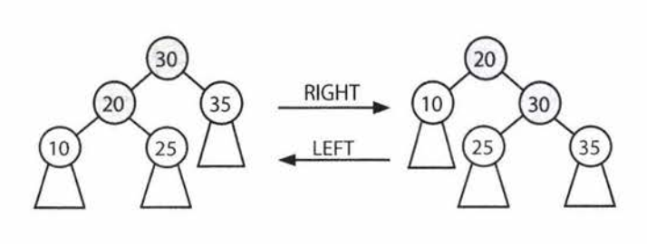

# Advanced Topics

*What is the relationship between log(b)k and log(x)k ?*

Assume c = log(b)k and y = log(x)k

log(b)k = c --> b^c = k // definition of log
log(x) b^c = log(x)k // Take log of both sides b^c = k
c log(x)b = log(x)k // move out the exponents
c = log(x)k/log(x)b = log(b)k

Therefore, if we want to convert log(2)p to log(10)p:

`log(10)p = log(2)p / log(2)10`

**Takeaway**: Logs of different bases are only off by a constant factor. For this reason, we largely ignore what the base of a log within a big O expression.

*Permutations*
How many ways are there of rearranging a string of n unique characters? You have n options for the first character, n - 1 for the second, n - 2 for the third, and so on.

**Answer**: n! ways

What if you were forming a k-length string (with all unique characters) from n total unique characters?

**Answer**: n! / (n-k)!

*Combinations*
You have a set of n unique characters. How many ways are there of selecting k characters into a new set?

**Answer**: n-choose-k = n!/((n-k)! * k!)

## Topological Sort
A topological sort of a directed graph is a way of ordering the list of nodes such that if (a, b) is an edge in the graph then a will appear before b in the list. If a graph has cycles or is not directed, then there is no topological sort.

We can construct a topological sort with the following approach:
1. Identify all nodes with no incoming edges and add those nodes to our topological sort.
  - We know those nodes are safe to add first since they have nothing that needs to come before them.
  - We know that such a node must exist if there's no cycle.
2. When we do the above, remove each node's outbound edges from the graph.
  - Those nodes have already been added to the topological sort, so they're irrelevant since we can't violate those edges anymore.
3. Repeat the above, adding nodes with no incoming edges and removing their outbound edges. When all nodes have been added to the topological sort, then we are done.

More formally,
1. Create a queue `order`, which will store the valid topological sort. It is currently empty.
2. Create a queue `processNext`. This queue will store the next nodes to process.
3. Count the number of incoming edges of each node and set a class variable `node.inbound`. Nodes typically only store their outgoing edges. However, you can count the inbound edges by walking through each node n and for each of its outgoing edges (n, x), increment `x.inbound`.
4. Walk through the nodes again and add to `processNext` any node where `x.inbound == 0`
5. While `processNext` is not empty, do the following:
  - Remove first node n from `processNext`
  - For each edge (n, x), decrement `x.inbound`. If `x.inbound == 0`, append x to `processNext`.
  - Append `n` to `order`.
6. If order contains all the nodes, then it has succeeded.

## Dijkstra's Algorithm
In some graphs, we might want to have edges with weights. Dijkstra's algorithm is a way to find the shortest path between two points in a weighted directed graph (which might have cycles). All edges must have positive values.

We could find the shortest path from s to t by literally taking all possible routes using actual time.
1. Start off at s
2. For each of s's outbound edges, clone ourselves and start walking.
3. Each time we get to a node, check if anyone's been there before. If so, then just stop, since we're not as fast as another path since someone has been here before. If no one has been here before, then clone ourselves and head out in all possible directions.
4. The first one to get to t wins.

Imagine that each clone could jump immediately from one node to its adjacent nodes (regardless of the edge weight), but it kept a time_so_far log of how long its path. Additionally, only one person moves at a time, and it's always the one with the lowest time_so_far.

This is how Dijkstra's algorithm works. It finds the minimum weight path from a start node s to *every* node on the graph.

We first initialize several variables:
- path_weight[node]: maps from each node to the total weight of the shortest path. All values are initialized to infinity, except for path_weight[a], which is initialized to 0.
- previous[node]: maps from each node to the previous node in the (current) shortest path.
- remaining: a priority queue of all nodes in the graph, where ach node's priority is defined by its path_weight.

Once we've initialized these values, we can start adjusting the values of path_weight.

We iterate through the nodes in `remaining` until `remaining` is empty, doing the following:
1. Select the node in `remaining` with the lowest value in path_weight. Call this node `n`
2. For each adjacent node, compare `path_weight[x]` (which is the weight of the current shortest path from a to x) to `path_weight[n]` + `edge_weight[(n, x)]`. If the latter is smaller than `path_weight[x]`, update `path_weight` and `previous`.
3. Remove `n` from `remaining`.

When `remaining` is empty, then path_weight stores the weight of the current shortest path from a to each node. We can reconstruct this path by tracing through `previous`.

## HashTable Collision Resolution
*Chaining with LinkedLists*  
Most common approach. The hash table's array maps to a linked list of items. We just add items to the linked list. In the worst case, the lookup is O(n), where n is the number of elements in the hash table. This would only happen with either very strange data or very poor hash function.

*Chaining with Binary Search Trees*  
Rather than storing collisions in a linked list, we could store collisions in a binary search tree. This will bring the worst-case runtime to O(log n).

In practice, we would rarely take this approach unless we expected an extremely non-uniform distribution.

*Open Addressing with Linear Probing*  
When a collision occurs, we just move on to the next index in the array until we find an open spot. If the number of collisions is low, this is a very fast and space-efficient solution.

Drawback: Total number of entries in the hash table is limited by the size of the array.

## Rabin-Karp Substring Search
The brute force way to search for a substring S in a larger string B takes O(s (b - s)) time. We do this by searching through the first b - s + 1 characters in B and, for each, checking if the next s characters match S.

The Rabin-Karp algorithm uses a little trick: if two strings are the same, they must have the same hash value. Therefore, if we efficiently precompute a hash value for each sequence of s characters within B, we can find the locations of S in O(b) time. Then, we just need to validate that those locations really do match S.

The worst case will take O(s(b-s)) time since many of the hash values could match.

## AVL-Trees
An AVL tree is one of two common ways to implement tree balancing.

### Properties
An AVL tree stores in each node the height of the subtrees rooted at this node. Then, for any node, we can check if it is height balanced.

`balance(n) = n.left.height - n.right.height`

`-1 <= balance(n) <= 1`

### Inserts
When you insert a node, the balance of some nodes might change to -2 or 2. Therefore, when we "unwind" the recursive stack, we check and fix the balance at each node. We do this through a series of rotations. Rotations can be either left or right rotations.

Depending on the balance and where the imbalance occurs, we fix it differently:
1. Case 1: Balance is 2.

In this case, the left's height is 2 bigger than the right's height. If the left side is larger, the left subtree's extra nodes must be hanging to the left (LEFT LEFT SHAPE) or the right (LEFT RIGHT SHAPE). If it looks like the LEFT RIGHT SHAPE, transform it with the rotations below into the LEFT LEFT SHAPE and then into BALANCED.

2. Case 2: Balance is -2

Mirror image of case 1.

