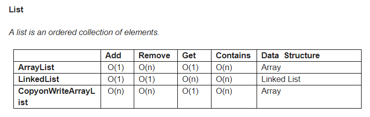
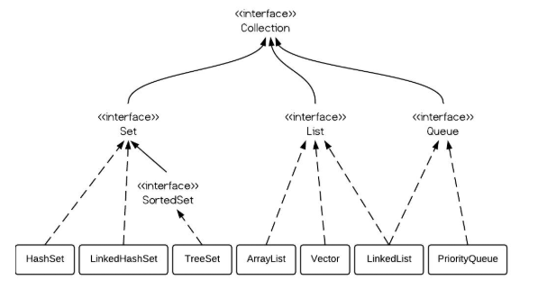

**Note**: For LinkedList, adding and removing elements take O(n) time to **traverse** to the location of the element, while the action of only **adding** and **removing** elements take O(1).

# List Overview
List is an **ordered** sequence of elements. When we talk about List, it is a good idea to compare it with Set (unordered).

# ArrayList vs LinkedList vs Vector
Their main difference is their implementation which causes **different performance for different operations**.

**ArrayList** is implemented as a resizable array - its size can increase dynamically.

**LinkedList** is implemented as a doubly linked list. Its performance on **add** and **remove** is better than ArrayList, but worse on **Get** and **Set** methods.
Unlike the other two, LinkedList implements Queue interface, which offers methods such as offer(), peek(), poll().

**Vector** is similar with ArrayList, but synchronized. As the collections need more space, Vector doubles its size, while ArrayList grow 50% of its size.

ArrayList is a better choice if your program is thread-safe.

In brief, LinkedList should be preferred to ArrayList if: 
- there are no large number of random access of element
- there are a large number of add/remove operations

# LinkedList
A linked list is another common data structure that complements the array data structure. Similar to the array, it is also a linear data structure and stores elements in a linear fashion.

However, unlike the array, it doesn’t store them in contiguous locations; instead, they are scattered everywhere in memory, which is connected to each other using nodes.

Because of this structure, **it’s easy to add and remove elements in a linked list**, as you just need to change the link instead of creating the array, but the search is difficult and often requires O(n) time to find an element in the singly linked list.

## Differences with Array
1. Array doesn't support random access. While LinkedList support random access, in order to retrieve an element, you need to traverse until that element. You can retrieve elements from arrays very quickly if you know the index.

2. Array needs contiguous memory allocation, so it might result in java.lang.OutOfMemoryError: Java Heap Space if there isn't enough contiguous memory in Java Heap.

3. Array is a fixed length data structure. LinkedList is a dynamic data structure.

4. Easier to insert and delete elements from LinkedList than Array (O(n) maximum complexity, if need to add element to end of the list then need to traverse the whole list). Arrays have fixed length, so need to do modifications to add elements to arrays if it exceeds the initial allocation.

5. Array is ideal for implementing fast caches e.g. HashMap or Hashtable, which requires constant time retrieval e.g. `Map` data structure provides O(1) performance for `get(Key key)` operation, while linked list based structure provides linear performance i.e. O(n) for retrieval operation, where n is the number of elements in linked list.
